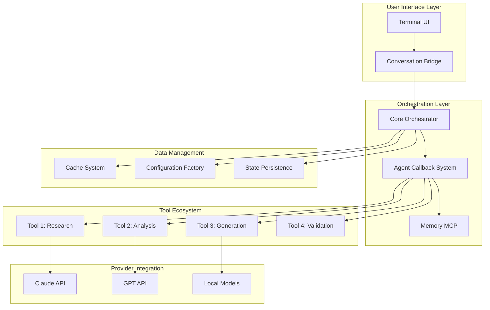
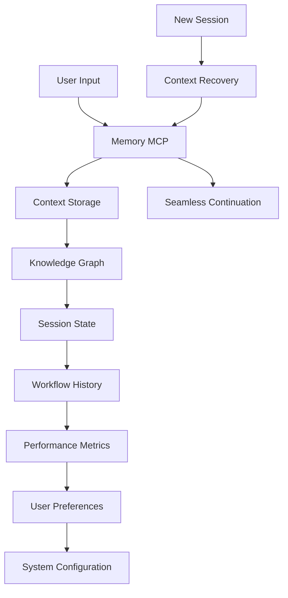
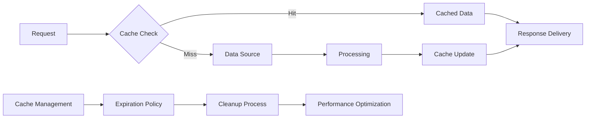

# SECTION II: QUICK REFERENCE & ARCHITECTURE
*Technical Foundations with Visual Diagrams*

---

## Chapter 2.1: Complete File Touchpoints Diagram

### The Mao Ecosystem Overview

**Mao's modular architecture** is built on **dynamic discovery patterns** - the system automatically finds and integrates components without hardcoded mappings.



### Directory Structure and Component Relationships

**Core Directory Organization:**
```
modular-agent-orchestrator/
├── tools/                    # Modular tool ecosystem
│   ├── research_tool/
│   │   ├── logic.py         # Core functionality
│   │   ├── button_research.py    # UI integration
│   │   ├── ui_research.py        # Interface components
│   │   └── research_tool.json    # Configuration
│   └── [11 other tools following same pattern]
├── orchestrator/            # Core coordination system
│   ├── core.py             # Main orchestration logic
│   ├── agent_callback.py   # Agent coordination
│   └── conversation_bridge.py    # UI communication
├── configs/                 # Dynamic configuration system
│   ├── user/               # User-specific settings
│   ├── models/             # Model configurations
│   ├── providers/          # Provider integrations
│   └── workflows/          # Workflow templates
└── .claude/                # CLI command system
    └── commands/           # Custom command definitions
```

### Key Integration Patterns

#### **4-File Tool Structure**
Every tool follows the consistent pattern:
- **`logic.py`**: Core functionality and business logic
- **`button_*.py`**: UI integration and user interactions
- **`ui_*.py`**: Interface components and visual elements
- **`*.json`**: Configuration and metadata

#### **3-File CLI Command Structure**
Custom commands use:
- **`command.py`**: Core command logic
- **`ui_command.py`**: User interface handling
- **`command.json`**: Command configuration and metadata

---

## Chapter 2.2: Template System & Configuration Factory

### Dynamic Configuration Generation

**The Problem Mao Solves**: Traditional AI tools require manual configuration of every combination of model, provider, and tool. Mao's **Configuration Factory** generates any needed configuration on demand.

#### **Configuration Templates**

**Tool Configuration Template:**
```json
{
  "name": "{tool_name}",
  "version": "1.0.0",
  "description": "{tool_description}",
  "dependencies": [
    "CacheManager",
    "@handle_errors",
    "estimate_cost"
  ],
  "providers": ["any"],
  "models": ["any"],
  "input_schema": {
    "type": "object",
    "properties": {
      "goal": {"type": "string"},
      "context": {"type": "object"}
    }
  },
  "output_schema": {
    "type": "object",
    "properties": {
      "result": {"type": "string"},
      "metadata": {"type": "object"}
    }
  }
}
```

**Model Configuration Template:**
```json
{
  "name": "{model_name}",
  "provider": "{provider_name}",
  "api_endpoint": "{endpoint}",
  "capabilities": [
    "text_generation",
    "analysis",
    "coding"
  ],
  "cost_per_1k_tokens": {
    "input": "{input_cost}",
    "output": "{output_cost}"
  },
  "context_window": "{context_size}",
  "rate_limits": {
    "requests_per_minute": "{rpm}",
    "tokens_per_minute": "{tpm}"
  }
}
```

#### **Drop-In/Drop-Out Modularity**

**Adding New Components:**
```bash
# Add new tool
mao add-tool research_assistant
# Automatically generates:
# - logic.py with standard patterns
# - button_research_assistant.py
# - ui_research_assistant.py  
# - research_assistant_tool.json

# Add new model
mao add-model claude-4 --provider anthropic
# Automatically generates:
# - Model configuration
# - Provider integration
# - Cost estimation setup
```

**Removing Components:**
```bash
# Remove tool (zero breaking changes)
mao remove-tool old_research
# Automatically:
# - Removes tool files
# - Updates configurations
# - Maintains workflow compatibility

# Remove provider (graceful degradation)
mao remove-provider old_api
# Automatically:
# - Redirects to fallback providers
# - Updates cost calculations
# - Preserves workflow functionality
```

### Template Inheritance System

#### **Base Templates**
- **Tool Base**: Standard patterns for all tools
- **Command Base**: CLI command foundations
- **Workflow Base**: Business process templates
- **Provider Base**: API integration patterns

#### **Specialized Templates**
- **Research Tools**: Web scraping, data analysis
- **Generation Tools**: Content creation, code generation
- **Analysis Tools**: Data processing, pattern recognition
- **Validation Tools**: Quality assurance, testing

#### **User Templates**
- **Custom Workflows**: User-defined process templates
- **Business Templates**: Industry-specific patterns
- **Integration Templates**: Third-party service connections

---

## Chapter 2.3: Modular Architecture Deep Dive

### The 11-Tool Ecosystem

**Current Production Tools:**
1. **Research Tool** - Web scraping and data gathering
2. **Analysis Tool** - Data processing and insights
3. **Generation Tool** - Content and code creation
4. **Validation Tool** - Quality assurance and testing
5. **Integration Tool** - Third-party service connections
6. **Workflow Tool** - Process orchestration
7. **Monitoring Tool** - System health and performance
8. **Optimization Tool** - Performance enhancement
9. **Security Tool** - Privacy and compliance
10. **Analytics Tool** - Usage tracking and insights
11. **Coordination Tool** - Multi-agent management

### Orchestrator Management Layer

#### **Core Orchestration Engine**

**`core.py` Responsibilities:**
- **Goal interpretation** and workflow planning
- **Resource allocation** and optimization
- **Quality assurance** and error recovery
- **Performance monitoring** and reporting

**`agent_callback.py` Responsibilities:**
- **Agent selection** based on capabilities
- **Task distribution** and load balancing
- **Progress tracking** and status updates
- **Result aggregation** and validation

**`conversation_bridge.py` Responsibilities:**
- **Natural language processing** for user input
- **Intent recognition** and goal extraction
- **Response formatting** and user communication
- **Session management** and context preservation

#### **Memory MCP as Single Source of Truth**

**Memory Architecture:**


**What Gets Stored:**
- **Conversation context** and user preferences
- **Workflow definitions** and execution history
- **Performance metrics** and optimization data
- **Error patterns** and resolution strategies
- **Cost tracking** and budget management
- **Quality assessments** and improvement recommendations

**Recovery Capabilities:**
- **Session restoration** after disconnection
- **Context preservation** across tool switches  
- **Learning retention** from previous interactions
- **Preference persistence** for user experience
- **Performance optimization** based on history

---

## Chapter 2.4: Data Flow Illustrations

### Technical Flows Showing HOW the Magic Happens

#### **Workflow Execution Data Flow**

```mermaid
graph LR
    A[User Goal: "Analyze Competitors"] --> B[Intent Parser]
    B --> C[Tool Selection Engine]
    C --> D[Agent Coordination Layer]
    D --> E[Web Research Agent]
    D --> F[Analysis Agent]
    D --> G[Report Generation Agent]
    E --> H[Raw Data Collection]
    F --> I[Structured Analysis]
    G --> J[Formatted Report]
    H --> K[Data Aggregation]
    I --> K
    J --> K
    K --> L[Deliverable: Competitor Analysis Report]
```

**Information Journey:**
1. **User Input**: Natural language goal description
2. **Intent Parsing**: Extract actionable requirements
3. **Tool Selection**: Choose optimal agents for task
4. **Agent Coordination**: Distribute work efficiently
5. **Parallel Execution**: Multiple agents work simultaneously
6. **Data Integration**: Combine results intelligently
7. **Quality Assurance**: Validate output quality
8. **Delivery**: Present results to user

#### **Cache Performance Pipeline**



**Performance Benefits:**
- **Instant responses** for repeated queries
- **Cost reduction** through result reuse
- **Load balancing** across providers
- **Quality consistency** through verified results

#### **Error Handling and Recovery Flow**

```mermaid
graph TD
    A[Operation Start] --> B{Error Occurs?}
    B -->|No| C[Successful Completion]
    B -->|Yes| D[@handle_errors Decorator]
    D --> E[Error Classification]
    E --> F{Recoverable?}
    F -->|Yes| G[Automatic Recovery]
    F -->|No| H[Graceful Degradation]
    G --> I[Retry Operation]
    H --> J[Alternative Approach]
    I --> K[Success Notification]
    J --> K
    K --> L[Continue Workflow]
```

**Error Handling Benefits:**
- **Automatic recovery** for transient issues
- **Graceful degradation** when services unavailable
- **User notification** without system crashes
- **Learning integration** to prevent future issues

#### **Cost Estimation and Monitoring**

```mermaid
graph LR
    A[Workflow Request] --> B[estimate_cost()]
    B --> C[Resource Requirements]
    C --> D[Provider Pricing]
    D --> E[Total Estimate]
    E --> F{Budget Check}
    F -->|Approved| G[Execute Workflow]
    F -->|Over Budget| H[Optimization Suggestions]
    G --> I[Real-time Monitoring]
    H --> I
    I --> J[Actual Cost Tracking]
    J --> K[Budget Updates]
```

**Cost Management Benefits:**
- **Predictable pricing** before execution
- **Budget protection** against overruns
- **Optimization suggestions** for cost reduction
- **Real-time monitoring** during execution

### Architecture That Enables Revolutionary Concepts

**Why This Architecture Matters:**

#### **Scalability**
- **Horizontal scaling** through modular components
- **Vertical optimization** through intelligent caching
- **Load distribution** across multiple providers
- **Resource efficiency** through smart coordination

#### **Reliability**
- **Zero breaking changes** through modular design
- **Automatic failover** between providers
- **Comprehensive error handling** at every level
- **State preservation** across system updates

#### **Extensibility**
- **Plugin architecture** for easy tool addition
- **Template system** for rapid customization
- **API integration** for third-party services
- **Configuration flexibility** for diverse use cases

#### **Performance**
- **Parallel execution** across multiple agents
- **Intelligent caching** for repeated operations
- **Cost optimization** through smart routing
- **Real-time monitoring** for continuous improvement

---

**The Technical Foundation is Solid**: This architecture proves that the revolutionary concepts in Mao are built on enterprise-grade technical foundations, not theoretical possibilities.

*Ready to see how users actually interact with this powerful system?*