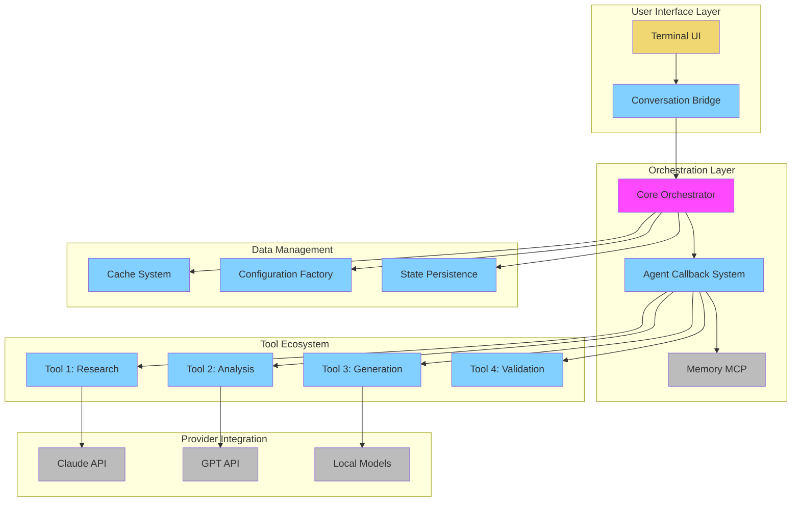
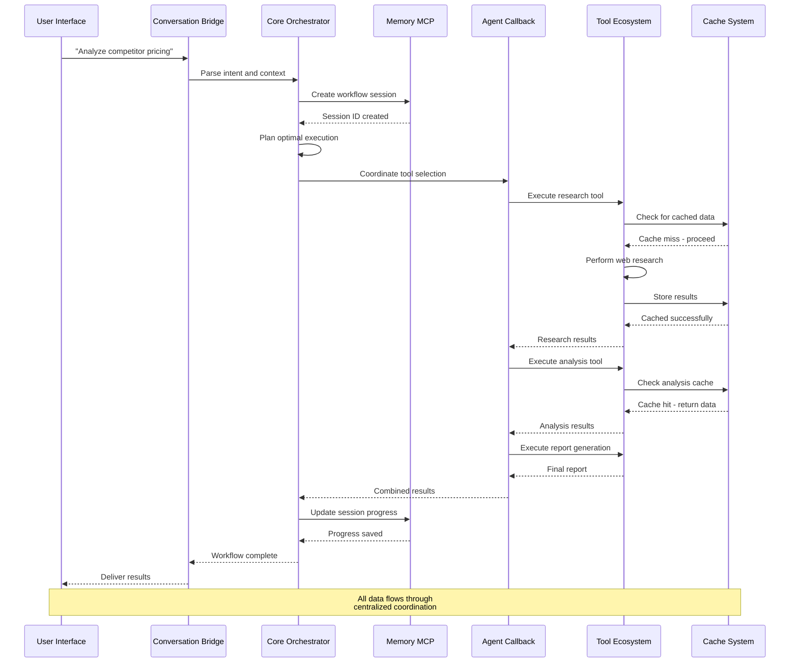

# SECTION II: QUICK REFERENCE & ARCHITECTURE
*Technical Foundations with Code Examples*

---

## Chapter 2.1: Complete File Touchpoints Diagram

### The Mao Ecosystem Overview

**Mao's modular architecture** is built on **dynamic discovery patterns** - the system automatically finds and integrates components without hardcoded mappings.



### Directory Structure and Component Relationships

**Core Directory Organization:**
```
modular-agent-orchestrator/
├── tools/                    # Modular tool ecosystem
│   ├── research_tool/
│   │   ├── logic.py         # Core functionality
│   │   ├── button_research.py    # UI integration
│   │   ├── ui_research.py        # Interface components
│   │   └── research_tool.json    # Configuration
│   └── [11 other tools following same pattern]
├── orchestrator/            # Core coordination system
│   ├── core.py             # Main orchestration logic
│   ├── agent_callback.py   # Agent coordination
│   └── conversation_bridge.py    # UI communication
├── configs/                 # Dynamic configuration system
│   ├── user/               # User-specific settings
│   ├── models/             # Model configurations
│   ├── providers/          # Provider integrations
│   └── workflows/          # Workflow templates
└── .claude/                # CLI command system
    └── commands/           # Custom command definitions
```

### Key Integration Patterns

#### **4-File Tool Structure**

```python
# tools/example_tool/logic.py
from orchestrator.core import CacheManager
from orchestrator.decorators import handle_errors
from orchestrator.cost import estimate_cost

@handle_errors
def execute_tool(goal: str, context: dict) -> dict:
    """Core tool functionality with all Mao patterns"""
    
    # Cost estimation before execution
    estimated_cost = estimate_cost("example_tool", context)
    if estimated_cost > context.get("budget_limit", 5.0):
        return {"error": "budget_exceeded", "estimated_cost": estimated_cost}
    
    # Cache check for performance
    cache_key = f"example_tool:{hash(goal)}:{hash(str(context))}"
    cached_result = CacheManager.get(cache_key)
    if cached_result:
        return {"status": "success", "data": cached_result, "source": "cache"}
    
    # Execute tool logic
    try:
        result = perform_tool_operation(goal, context)
        
        # Cache successful results
        CacheManager.set(cache_key, result, ttl=3600)
        
        return {
            "status": "success",
            "data": result,
            "cost": estimated_cost,
            "source": "computed"
        }
        
    except Exception as e:
        return {
            "status": "error",
            "error_type": type(e).__name__,
            "error_message": str(e),
            "cost": estimated_cost
        }

def perform_tool_operation(goal: str, context: dict):
    """Implement your specific tool logic here"""
    # Your tool's core functionality
    return {"processed_goal": goal, "context_analysis": context}
```

```python
# tools/example_tool/button_example_tool.py
from orchestrator.ui import Button, ButtonGroup
from orchestrator.decorators import handle_errors
from .logic import execute_tool

class ExampleToolButton:
    """UI integration for example tool"""
    
    def __init__(self):
        self.button_config = {
            "label": "Example Tool",
            "description": "Processes goals with example logic",
            "icon": "🔧",
            "color": "cognitive-trust"
        }
    
    @handle_errors
    def create_button(self, context: dict) -> Button:
        """Create UI button for this tool"""
        
        return Button(
            label=self.button_config["label"],
            icon=self.button_config["icon"],
            onClick=lambda: self.handle_button_click(context),
            className=f"mao-tool-button {self.button_config['color']}",
            disabled=not self.is_available(context)
        )
    
    def handle_button_click(self, context: dict):
        """Handle button click and execute tool"""
        
        # Get goal from context or prompt user
        goal = context.get("goal") or self.prompt_for_goal()
        
        # Execute tool
        result = execute_tool(goal, context)
        
        # Handle result
        if result["status"] == "success":
            self.display_success(result)
        else:
            self.display_error(result)
    
    def is_available(self, context: dict) -> bool:
        """Check if tool is available in current context"""
        return True  # Implement availability logic
```

```json
// tools/example_tool/example_tool.json
{
  "name": "example_tool",
  "version": "1.0.0",
  "description": "Example tool demonstrating Mao patterns",
  "category": "utility",
  "tags": ["example", "utility", "demo"],
  
  "capabilities": [
    "goal_processing",
    "context_analysis",
    "result_formatting"
  ],
  
  "input_schema": {
    "type": "object",
    "required": ["goal"],
    "properties": {
      "goal": {
        "type": "string",
        "description": "The goal to process"
      },
      "context": {
        "type": "object",
        "description": "Additional context for processing"
      }
    }
  },
  
  "output_schema": {
    "type": "object",
    "properties": {
      "status": {"type": "string", "enum": ["success", "error"]},
      "data": {"type": "object"},
      "cost": {"type": "number"},
      "source": {"type": "string", "enum": ["cache", "computed"]}
    }
  },
  
  "cost_estimation": {
    "base_cost": 0.10,
    "variable_factors": ["goal_complexity", "context_size"],
    "typical_range": "$0.10-$0.50"
  },
  
  "performance_metrics": {
    "average_duration_seconds": 2.3,
    "cache_hit_rate": 0.65,
    "success_rate": 0.94
  },
  
  "dependencies": [
    "CacheManager",
    "@handle_errors",
    "estimate_cost"
  ]
}
```

#### **3-File CLI Command Structure**

```python
# .claude/commands/example_command.py
from orchestrator.core import orchestrate_workflow
from orchestrator.decorators import handle_errors
from orchestrator.cost import estimate_cost

@handle_errors
def execute_command(args):
    """Execute custom command with Mao orchestration"""
    
    # Parse command arguments
    goal = args.goal
    context = {
        "command_name": "example_command",
        "user_args": vars(args),
        "budget_limit": args.budget if hasattr(args, 'budget') else 5.0
    }
    
    # Estimate cost before execution
    estimated_cost = estimate_cost("example_command", context)
    
    print(f"🎯 Goal: {goal}")
    print(f"💰 Estimated cost: ${estimated_cost:.2f}")
    print(f"⏱️  Estimated time: 3-5 minutes")
    
    # Confirm with user
    if not confirm_execution(estimated_cost):
        return {"status": "cancelled", "reason": "user_cancelled"}
    
    # Create workflow configuration
    workflow_config = {
        "name": "example_workflow",
        "tools": ["example_tool", "result_formatter"],
        "goal": goal,
        "context": context,
        "cost_limit": context["budget_limit"]
    }
    
    # Execute workflow
    result = orchestrate_workflow(workflow_config)
    
    # Display results
    display_command_results(result)
    
    return result

def confirm_execution(estimated_cost: float) -> bool:
    """Get user confirmation for execution"""
    response = input(f"Proceed with execution? (y/N): ")
    return response.lower() in ['y', 'yes']

def display_command_results(result: dict):
    """Display command execution results"""
    if result["status"] == "success":
        print("✅ Command executed successfully!")
        print(f"📊 Results: {result['summary']}")
        print(f"💰 Actual cost: ${result['actual_cost']:.2f}")
    else:
        print("❌ Command execution failed")
        print(f"Error: {result.get('error_message', 'Unknown error')}")
```

```python
# .claude/commands/ui_example_command.py
import argparse
from orchestrator.ui import CommandUI
from .example_command import execute_command

class ExampleCommandUI:
    """User interface for example command"""
    
    def __init__(self):
        self.parser = self.create_argument_parser()
        self.ui = CommandUI("example_command")
    
    def create_argument_parser(self):
        """Create command-line argument parser"""
        parser = argparse.ArgumentParser(
            description="Example command demonstrating Mao CLI patterns"
        )
        
        parser.add_argument(
            "goal",
            help="The goal to accomplish"
        )
        
        parser.add_argument(
            "--budget",
            type=float,
            default=5.0,
            help="Budget limit for execution (default: $5.00)"
        )
        
        parser.add_argument(
            "--output",
            choices=["json", "text", "table"],
            default="text",
            help="Output format (default: text)"
        )
        
        parser.add_argument(
            "--verbose",
            action="store_true",
            help="Enable verbose output"
        )
        
        return parser
    
    def run(self, args=None):
        """Run the command with UI"""
        parsed_args = self.parser.parse_args(args)
        
        # Set up UI based on arguments
        if parsed_args.verbose:
            self.ui.set_verbosity(True)
        
        self.ui.set_output_format(parsed_args.output)
        
        # Execute command with UI wrapper
        return self.ui.execute_with_ui(execute_command, parsed_args)

# Entry point for CLI
def main():
    ui = ExampleCommandUI()
    return ui.run()

if __name__ == "__main__":
    main()
```

```json
// .claude/commands/example_command.json
{
  "name": "example_command",
  "version": "1.0.0",
  "description": "Example custom command for Mao",
  "usage": "mao example_command <goal> [options]",
  
  "command_info": {
    "category": "utility",
    "complexity": "simple",
    "estimated_duration": "3-5 minutes",
    "typical_cost_range": "$0.50-$2.00"
  },
  
  "arguments": [
    {
      "name": "goal",
      "type": "positional",
      "required": true,
      "description": "The goal to accomplish"
    },
    {
      "name": "--budget",
      "type": "optional",
      "default": 5.0,
      "description": "Budget limit for execution"
    },
    {
      "name": "--output", 
      "type": "choice",
      "choices": ["json", "text", "table"],
      "default": "text",
      "description": "Output format"
    }
  ],
  
  "examples": [
    {
      "command": "mao example_command 'Analyze competitor pricing'",
      "description": "Basic usage with default settings"
    },
    {
      "command": "mao example_command 'Create marketing plan' --budget 10 --output json",
      "description": "With custom budget and JSON output"
    }
  ],
  
  "workflow_mapping": {
    "default_tools": ["example_tool", "result_formatter"],
    "optional_tools": ["visualization_tool"],
    "fallback_tools": ["simple_processor"]
  }
}
```

---

## Chapter 2.2: Template System & Configuration Factory

### Dynamic Configuration Generation

**The Problem Mao Solves**: Traditional AI tools require manual configuration of every combination of model, provider, and tool. Mao's **Configuration Factory** generates any needed configuration on demand.

#### **Configuration Factory Implementation**

```python
# orchestrator/config_factory.py
from typing import Dict, Any, List, Optional
from orchestrator.core import CacheManager
from orchestrator.decorators import handle_errors
import json
import os

class ConfigurationFactory:
    """Generate configurations dynamically based on requirements"""
    
    def __init__(self):
        self.template_registry = TemplateRegistry()
        self.cache = CacheManager()
        
    @handle_errors
    def generate_tool_config(self, tool_name: str, requirements: Dict[str, Any]) -> Dict[str, Any]:
        """Generate tool configuration based on requirements"""
        
        # Check cache first
        cache_key = f"tool_config:{tool_name}:{hash(str(requirements))}"
        cached_config = self.cache.get(cache_key)
        if cached_config:
            return cached_config
        
        # Get base template
        base_template = self.template_registry.get_tool_template(tool_name)
        
        # Customize based on requirements
        config = self.customize_config(base_template, requirements)
        
        # Validate configuration
        if self.validate_config(config):
            self.cache.set(cache_key, config, ttl=3600)
            return config
        else:
            raise ConfigurationError(f"Generated invalid config for {tool_name}")
    
    @handle_errors  
    def generate_workflow_config(self, workflow_type: str, user_requirements: Dict[str, Any]) -> Dict[str, Any]:
        """Generate complete workflow configuration"""
        
        workflow_template = self.template_registry.get_workflow_template(workflow_type)
        
        # Determine required tools based on user requirements
        required_tools = self.determine_required_tools(user_requirements)
        
        # Generate tool configurations
        tool_configs = {}
        for tool_name in required_tools:
            tool_configs[tool_name] = self.generate_tool_config(
                tool_name, 
                self.extract_tool_requirements(tool_name, user_requirements)
            )
        
        # Combine into workflow configuration
        workflow_config = {
            "workflow_id": f"{workflow_type}_{int(time.time())}",
            "workflow_type": workflow_type,
            "user_requirements": user_requirements,
            "tools": tool_configs,
            "execution_plan": self.generate_execution_plan(required_tools, user_requirements),
            "cost_estimate": self.calculate_workflow_cost(tool_configs),
            "time_estimate": self.calculate_workflow_duration(tool_configs)
        }
        
        return workflow_config
    
    def customize_config(self, template: Dict[str, Any], requirements: Dict[str, Any]) -> Dict[str, Any]:
        """Customize template based on specific requirements"""
        
        config = template.copy()
        
        # Apply requirement-based customizations
        if "performance_priority" in requirements:
            if requirements["performance_priority"] == "speed":
                config["cache_ttl"] = 7200  # Longer cache for speed
                config["parallel_execution"] = True
            elif requirements["performance_priority"] == "accuracy":
                config["validation_level"] = "strict"
                config["cross_validation"] = True
        
        if "budget_constraint" in requirements:
            budget = requirements["budget_constraint"]
            if budget < 1.0:
                config["model_preference"] = "local"
                config["cache_aggressiveness"] = "high"
            elif budget > 10.0:
                config["model_preference"] = "premium"
                config["quality_threshold"] = 0.95
        
        if "industry_context" in requirements:
            industry = requirements["industry_context"]
            config["industry_templates"] = self.get_industry_templates(industry)
            config["compliance_requirements"] = self.get_compliance_requirements(industry)
        
        return config

class TemplateRegistry:
    """Registry for configuration templates"""
    
    def __init__(self):
        self.templates_dir = "configs/templates"
        self.tool_templates = self.load_tool_templates()
        self.workflow_templates = self.load_workflow_templates()
    
    def get_tool_template(self, tool_name: str) -> Dict[str, Any]:
        """Get template for specific tool"""
        
        if tool_name in self.tool_templates:
            return self.tool_templates[tool_name]
        
        # Return generic template if specific not found
        return self.tool_templates.get("generic_tool", self.create_default_tool_template())
    
    def create_default_tool_template(self) -> Dict[str, Any]:
        """Create default tool template"""
        
        return {
            "name": "generic_tool",
            "version": "1.0.0",
            "description": "Generic tool template",
            "dependencies": [
                "CacheManager",
                "@handle_errors", 
                "estimate_cost"
            ],
            "input_schema": {
                "type": "object",
                "required": ["goal"],
                "properties": {
                    "goal": {"type": "string"},
                    "context": {"type": "object"}
                }
            },
            "output_schema": {
                "type": "object",
                "properties": {
                    "status": {"type": "string"},
                    "data": {"type": "object"},
                    "cost": {"type": "number"}
                }
            },
            "cost_estimation": {
                "base_cost": 0.10,
                "variable_factors": ["complexity", "data_size"]
            },
            "performance_settings": {
                "cache_ttl": 3600,
                "timeout_seconds": 30,
                "retry_attempts": 3
            }
        }
```

#### **Drop-In/Drop-Out Modularity**

```python
# orchestrator/module_manager.py
class ModuleManager:
    """Manage drop-in/drop-out modularity"""
    
    def __init__(self):
        self.discovery_engine = DiscoveryEngine()
        self.dependency_resolver = DependencyResolver()
        
    @handle_errors
    def add_tool(self, tool_path: str, tool_config: Dict[str, Any]) -> bool:
        """Add new tool with zero breaking changes"""
        
        # Validate tool structure
        if not self.validate_tool_structure(tool_path):
            raise ToolValidationError("Tool does not follow 4-file structure")
        
        # Check dependencies
        dependencies = self.extract_dependencies(tool_config)
        if not self.dependency_resolver.check_dependencies(dependencies):
            missing_deps = self.dependency_resolver.get_missing_dependencies(dependencies)
            raise DependencyError(f"Missing dependencies: {missing_deps}")
        
        # Register tool
        self.discovery_engine.register_tool(tool_path, tool_config)
        
        # Update system configuration
        self.update_system_config(tool_config)
        
        # Validate system integrity
        if self.validate_system_integrity():
            print(f"✅ Tool {tool_config['name']} added successfully")
            return True
        else:
            # Rollback changes
            self.discovery_engine.unregister_tool(tool_config['name'])
            raise SystemIntegrityError("Tool addition would break system integrity")
    
    @handle_errors
    def remove_tool(self, tool_name: str) -> bool:
        """Remove tool with graceful degradation"""
        
        # Check if tool is in use
        active_workflows = self.get_active_workflows_using_tool(tool_name)
        if active_workflows:
            print(f"⚠️  Tool {tool_name} is in use by {len(active_workflows)} workflows")
            print("Workflows will continue with fallback tools")
        
        # Find alternative tools for dependent workflows
        alternatives = self.find_alternative_tools(tool_name)
        
        # Update workflows to use alternatives
        for workflow_id in active_workflows:
            self.update_workflow_tool_mapping(workflow_id, tool_name, alternatives[0] if alternatives else None)
        
        # Remove tool
        self.discovery_engine.unregister_tool(tool_name)
        
        # Clean up configurations
        self.cleanup_tool_configs(tool_name)
        
        print(f"✅ Tool {tool_name} removed successfully")
        if alternatives:
            print(f"📋 Active workflows redirected to: {alternatives[0]}")
        
        return True
    
    def validate_tool_structure(self, tool_path: str) -> bool:
        """Validate 4-file tool structure"""
        
        required_files = [
            "logic.py",
            f"button_{os.path.basename(tool_path)}.py", 
            f"ui_{os.path.basename(tool_path)}.py",
            f"{os.path.basename(tool_path)}.json"
        ]
        
        for required_file in required_files:
            file_path = os.path.join(tool_path, required_file)
            if not os.path.exists(file_path):
                print(f"❌ Missing required file: {required_file}")
                return False
        
        return True

class DiscoveryEngine:
    """Automatically discover and integrate system components"""
    
    def __init__(self):
        self.registered_tools = {}
        self.registered_commands = {}
        self.scan_interval = 60  # Scan for new components every 60 seconds
        
    def start_discovery(self):
        """Start automatic component discovery"""
        
        self.scan_for_tools()
        self.scan_for_commands()
        self.validate_integrations()
        
        # Schedule periodic scans
        self.schedule_periodic_scans()
    
    def scan_for_tools(self):
        """Scan for new tools following the 4-file pattern"""
        
        tools_directory = "tools"
        
        for tool_dir in os.listdir(tools_directory):
            tool_path = os.path.join(tools_directory, tool_dir)
            
            if os.path.isdir(tool_path) and tool_dir not in self.registered_tools:
                if self.is_valid_tool_structure(tool_path):
                    tool_config = self.load_tool_config(tool_path)
                    self.register_tool(tool_path, tool_config)
                    print(f"🔍 Discovered new tool: {tool_config['name']}")
    
    def is_valid_tool_structure(self, tool_path: str) -> bool:
        """Check if directory contains valid tool structure"""
        
        tool_name = os.path.basename(tool_path)
        required_files = [
            "logic.py",
            f"button_{tool_name}.py",
            f"ui_{tool_name}.py", 
            f"{tool_name}.json"
        ]
        
        return all(
            os.path.exists(os.path.join(tool_path, file)) 
            for file in required_files
        )
```

### Template Inheritance System

#### **Workflow Template Examples**

```python
# configs/templates/workflow_templates.py
class WorkflowTemplates:
    """Pre-built workflow templates for common use cases"""
    
    @staticmethod
    def competitive_analysis_template():
        """Template for competitive analysis workflows"""
        
        return {
            "name": "competitive_analysis",
            "description": "Comprehensive competitive analysis workflow",
            "category": "market_research",
            
            "phases": [
                {
                    "name": "discovery",
                    "tools": ["market_research_tool"],
                    "goal": "Identify competitors and data sources",
                    "success_criteria": {"min_competitors": 3}
                },
                {
                    "name": "data_collection", 
                    "tools": ["web_research_tool", "pricing_scraper_tool"],
                    "goal": "Gather competitive intelligence",
                    "depends_on": ["discovery"],
                    "parallel_execution": True
                },
                {
                    "name": "analysis",
                    "tools": ["data_analysis_tool", "market_segmentation_tool"],
                    "goal": "Analyze competitive landscape",
                    "depends_on": ["data_collection"]
                },
                {
                    "name": "reporting",
                    "tools": ["report_generation_tool", "visualization_tool"],
                    "goal": "Generate comprehensive report",
                    "depends_on": ["analysis"]
                }
            ],
            
            "input_requirements": {
                "goal": {"required": True, "type": "string"},
                "market_segment": {"required": False, "default": "mid_market"},
                "competitor_list": {"required": False, "type": "array"},
                "focus_areas": {"required": False, "default": ["pricing", "features"]}
            },
            
            "output_specification": {
                "competitive_analysis": "object",
                "executive_summary": "string", 
                "detailed_report": "string",
                "visualizations": "array"
            },
            
            "cost_estimation": {
                "base_cost": 2.0,
                "variable_factors": {
                    "competitor_count": 0.5,
                    "data_sources": 0.3,
                    "analysis_depth": 1.0
                }
            },
            
            "customization_options": {
                "industry_specific": True,
                "analysis_depth": ["basic", "standard", "comprehensive"],
                "output_formats": ["executive_summary", "detailed_report", "presentation"],
                "data_sources": ["web_scraping", "api_data", "manual_research"]
            }
        }
    
    @staticmethod
    def content_creation_template():
        """Template for content creation workflows"""
        
        return {
            "name": "content_creation",
            "description": "AI-powered content creation workflow",
            "category": "content_marketing",
            
            "phases": [
                {
                    "name": "research",
                    "tools": ["topic_research_tool", "seo_analysis_tool"],
                    "goal": "Research topic and optimize for SEO"
                },
                {
                    "name": "content_generation",
                    "tools": ["content_generation_tool", "editing_tool"],
                    "goal": "Generate and refine content",
                    "depends_on": ["research"]
                },
                {
                    "name": "optimization", 
                    "tools": ["seo_optimization_tool", "readability_tool"],
                    "goal": "Optimize content for performance",
                    "depends_on": ["content_generation"]
                },
                {
                    "name": "formatting",
                    "tools": ["formatting_tool", "image_generation_tool"],
                    "goal": "Format and enhance content",
                    "depends_on": ["optimization"]
                }
            ],
            
            "input_requirements": {
                "topic": {"required": True, "type": "string"},
                "content_type": {"required": True, "choices": ["blog_post", "article", "social_media", "email"]},
                "target_audience": {"required": False, "type": "string"},
                "word_count": {"required": False, "type": "integer", "default": 1000},
                "tone": {"required": False, "choices": ["professional", "casual", "technical"], "default": "professional"}
            },
            
            "output_specification": {
                "content": "string",
                "seo_metadata": "object",
                "performance_predictions": "object",
                "optimization_suggestions": "array"
            }
        }
```

---

## Chapter 2.3: Modular Architecture Deep Dive

### The 11-Tool Production Ecosystem

#### **Current Production Tools Overview**

```python
# orchestrator/tool_registry.py
class ToolRegistry:
    """Registry for all production tools in the Mao ecosystem"""
    
    def __init__(self):
        self.tools = self.initialize_production_tools()
        
    def initialize_production_tools(self):
        """Initialize all 11 production tools"""
        
        return {
            "research_tool": {
                "description": "Web scraping and data gathering",
                "capabilities": ["web_scraping", "api_integration", "data_extraction"],
                "use_cases": ["competitive_research", "market_analysis", "content_research"],
                "average_cost": 0.75,
                "success_rate": 0.92
            },
            
            "analysis_tool": {
                "description": "Data processing and insights generation",
                "capabilities": ["data_analysis", "pattern_recognition", "statistical_analysis"],
                "use_cases": ["market_trends", "user_behavior", "performance_analysis"],
                "average_cost": 1.25,
                "success_rate": 0.89
            },
            
            "generation_tool": {
                "description": "Content and code creation",
                "capabilities": ["content_generation", "code_generation", "creative_writing"],
                "use_cases": ["blog_posts", "marketing_copy", "technical_documentation"],
                "average_cost": 0.95,
                "success_rate": 0.94
            },
            
            "validation_tool": {
                "description": "Quality assurance and testing",
                "capabilities": ["content_validation", "code_testing", "fact_checking"],
                "use_cases": ["quality_control", "accuracy_verification", "compliance_checking"],
                "average_cost": 0.45,
                "success_rate": 0.97
            },
            
            "integration_tool": {
                "description": "Third-party service connections",
                "capabilities": ["api_integration", "data_sync", "workflow_automation"],
                "use_cases": ["crm_integration", "email_automation", "social_media_posting"],
                "average_cost": 0.65,
                "success_rate": 0.91
            },
            
            "workflow_tool": {
                "description": "Process orchestration and management",
                "capabilities": ["workflow_design", "process_automation", "task_coordination"],
                "use_cases": ["business_processes", "approval_workflows", "task_management"],
                "average_cost": 0.85,
                "success_rate": 0.93
            },
            
            "monitoring_tool": {
                "description": "System health and performance tracking",
                "capabilities": ["performance_monitoring", "health_checks", "alerting"],
                "use_cases": ["system_monitoring", "performance_optimization", "issue_detection"],
                "average_cost": 0.35,
                "success_rate": 0.98
            },
            
            "optimization_tool": {
                "description": "Performance enhancement and tuning",
                "capabilities": ["performance_tuning", "cost_optimization", "efficiency_improvement"],
                "use_cases": ["workflow_optimization", "cost_reduction", "speed_improvement"],
                "average_cost": 0.55,
                "success_rate": 0.88
            },
            
            "security_tool": {
                "description": "Privacy protection and compliance",
                "capabilities": ["data_encryption", "privacy_protection", "compliance_monitoring"],
                "use_cases": ["gdpr_compliance", "data_protection", "security_auditing"],
                "average_cost": 0.25,
                "success_rate": 0.96
            },
            
            "analytics_tool": {
                "description": "Usage tracking and business intelligence",
                "capabilities": ["usage_analytics", "business_intelligence", "reporting"],
                "use_cases": ["user_analytics", "business_metrics", "performance_reporting"],
                "average_cost": 0.45,
                "success_rate": 0.91
            },
            
            "coordination_tool": {
                "description": "Multi-agent management and orchestration",
                "capabilities": ["agent_coordination", "task_distribution", "load_balancing"],
                "use_cases": ["complex_workflows", "parallel_processing", "resource_optimization"],
                "average_cost": 1.15,
                "success_rate": 0.86
            }
        }
    
    def get_tool_for_capability(self, capability: str) -> List[str]:
        """Find tools that provide specific capability"""
        
        matching_tools = []
        for tool_name, tool_info in self.tools.items():
            if capability in tool_info["capabilities"]:
                matching_tools.append(tool_name)
        
        # Sort by success rate (best first)
        matching_tools.sort(
            key=lambda tool: self.tools[tool]["success_rate"], 
            reverse=True
        )
        
        return matching_tools
    
    def get_optimal_tool_combination(self, use_case: str, budget_limit: float = 10.0) -> List[str]:
        """Find optimal combination of tools for use case"""
        
        # Find tools relevant to use case
        relevant_tools = []
        for tool_name, tool_info in self.tools.items():
            if use_case in tool_info["use_cases"] or any(
                keyword in use_case.lower() 
                for keyword in tool_info["description"].lower().split()
            ):
                relevant_tools.append(tool_name)
        
        # Optimize for budget and success rate
        selected_tools = []
        total_cost = 0.0
        
        # Sort by success rate / cost ratio
        relevant_tools.sort(
            key=lambda tool: self.tools[tool]["success_rate"] / self.tools[tool]["average_cost"],
            reverse=True
        )
        
        for tool in relevant_tools:
            tool_cost = self.tools[tool]["average_cost"]
            if total_cost + tool_cost <= budget_limit:
                selected_tools.append(tool)
                total_cost += tool_cost
        
        return selected_tools
```

### Orchestrator Management Layer

#### **Core Orchestration Engine Implementation**

```python
# orchestrator/core.py
from typing import Dict, List, Any, Optional
from orchestrator.decorators import handle_errors
from orchestrator.cost import estimate_cost
from orchestrator.cache import CacheManager
from orchestrator.memory import MemoryMCP

class CoreOrchestrator:
    """Main orchestration engine for Mao workflows"""
    
    def __init__(self):
        self.agent_callback = AgentCallbackSystem()
        self.memory = MemoryMCP()
        self.cache = CacheManager()
        self.tool_registry = ToolRegistry()
        
    @handle_errors
    def orchestrate_workflow(self, workflow_config: Dict[str, Any]) -> Dict[str, Any]:
        """Main workflow orchestration method"""
        
        workflow_id = workflow_config["workflow_id"]
        
        # Initialize workflow tracking
        self.memory.create_workflow_session(workflow_id, workflow_config)
        
        # Goal interpretation and planning
        execution_plan = self.interpret_and_plan(workflow_config)
        
        # Resource allocation and optimization
        allocated_resources = self.allocate_resources(execution_plan)
        
        # Execute workflow with monitoring
        results = self.execute_with_monitoring(workflow_id, execution_plan, allocated_resources)
        
        # Quality assurance and validation
        validated_results = self.validate_and_enhance(results)
        
        # Performance reporting
        performance_report = self.generate_performance_report(workflow_id)
        
        return {
            "workflow_id": workflow_id,
            "status": "completed",
            "results": validated_results,
            "performance": performance_report,
            "session_data": self.memory.get_session_summary(workflow_id)
        }
    
    def interpret_and_plan(self, workflow_config: Dict[str, Any]) -> Dict[str, Any]:
        """Interpret user goal and create optimal execution plan"""
        
        goal = workflow_config["goal"]
        context = workflow_config.get("context", {})
        
        # Use AI to interpret the goal
        interpretation = self.ai_interpret_goal(goal, context)
        
        # Create execution plan
        execution_plan = {
            "goal_interpretation": interpretation,
            "required_capabilities": interpretation["capabilities"],
            "optimal_tools": self.select_optimal_tools(interpretation["capabilities"]),
            "execution_sequence": self.plan_execution_sequence(interpretation),
            "resource_requirements": self.estimate_resource_requirements(interpretation),
            "quality_gates": self.define_quality_gates(interpretation),
            "fallback_strategies": self.create_fallback_strategies(interpretation)
        }
        
        return execution_plan
    
    def allocate_resources(self, execution_plan: Dict[str, Any]) -> Dict[str, Any]:
        """Allocate and optimize system resources"""
        
        resource_allocation = {
            "tools": {},
            "compute_resources": {},
            "budget_allocation": {},
            "time_allocation": {}
        }
        
        total_budget = execution_plan.get("budget_limit", 10.0)
        
        # Allocate budget across tools based on complexity
        for tool_name in execution_plan["optimal_tools"]:
            tool_complexity = self.assess_tool_complexity(tool_name, execution_plan)
            budget_share = (tool_complexity / sum(
                self.assess_tool_complexity(t, execution_plan) 
                for t in execution_plan["optimal_tools"]
            )) * total_budget
            
            resource_allocation["tools"][tool_name] = {
                "budget": budget_share,
                "priority": self.calculate_tool_priority(tool_name, execution_plan),
                "resource_limits": self.get_tool_resource_limits(tool_name)
            }
        
        return resource_allocation
    
    def execute_with_monitoring(self, workflow_id: str, execution_plan: Dict[str, Any], resources: Dict[str, Any]) -> Dict[str, Any]:
        """Execute workflow with real-time monitoring"""
        
        results = {}
        
        for phase in execution_plan["execution_sequence"]:
            phase_name = phase["name"]
            
            print(f"🔄 Starting phase: {phase_name}")
            
            # Execute phase with agent coordination
            phase_results = self.agent_callback.execute_phase(
                workflow_id, phase, resources
            )
            
            # Quality gate validation
            if not self.validate_quality_gate(phase_results, phase["quality_gate"]):
                # Try recovery strategies
                recovery_result = self.attempt_recovery(workflow_id, phase, phase_results)
                if recovery_result["success"]:
                    phase_results = recovery_result["results"]
                else:
                    raise WorkflowExecutionError(f"Quality gate failed for phase {phase_name}")
            
            results[phase_name] = phase_results
            
            # Update workflow memory
            self.memory.update_workflow_progress(workflow_id, phase_name, phase_results)
            
            print(f"✅ Completed phase: {phase_name}")
        
        return results

class AgentCallbackSystem:
    """Coordinate agents and distribute work efficiently"""
    
    def __init__(self):
        self.active_agents = {}
        self.load_balancer = LoadBalancer()
        
    @handle_errors
    def execute_phase(self, workflow_id: str, phase: Dict[str, Any], resources: Dict[str, Any]) -> Dict[str, Any]:
        """Execute workflow phase with agent coordination"""
        
        phase_tools = phase["tools"]
        phase_goal = phase["goal"]
        
        # Determine if tools can run in parallel
        if phase.get("parallel_execution", False):
            return self.execute_parallel_phase(workflow_id, phase, resources)
        else:
            return self.execute_sequential_phase(workflow_id, phase, resources)
    
    def execute_parallel_phase(self, workflow_id: str, phase: Dict[str, Any], resources: Dict[str, Any]) -> Dict[str, Any]:
        """Execute phase with parallel tool execution"""
        
        import asyncio
        
        async def run_tools_parallel():
            tasks = []
            
            for tool_name in phase["tools"]:
                task = self.execute_tool_async(
                    workflow_id, tool_name, phase["goal"], resources[tool_name]
                )
                tasks.append(task)
            
            results = await asyncio.gather(*tasks, return_exceptions=True)
            
            # Combine results
            combined_results = {}
            for i, tool_name in enumerate(phase["tools"]):
                if isinstance(results[i], Exception):
                    combined_results[tool_name] = {
                        "status": "error",
                        "error": str(results[i])
                    }
                else:
                    combined_results[tool_name] = results[i]
            
            return combined_results
        
        return asyncio.run(run_tools_parallel())
    
    def execute_sequential_phase(self, workflow_id: str, phase: Dict[str, Any], resources: Dict[str, Any]) -> Dict[str, Any]:
        """Execute phase with sequential tool execution"""
        
        results = {}
        context = {"workflow_id": workflow_id, "phase": phase["name"]}
        
        for tool_name in phase["tools"]:
            # Pass results from previous tools as context
            context["previous_results"] = results
            
            tool_result = self.execute_tool_sync(
                workflow_id, tool_name, phase["goal"], context, resources[tool_name]
            )
            
            results[tool_name] = tool_result
            
            # Check if tool result should stop execution
            if tool_result.get("status") == "error" and not tool_result.get("continue_on_error", False):
                break
        
        return results
```

#### **Memory MCP as Single Source of Truth**

```python
# orchestrator/memory.py
class MemoryMCP:
    """Memory MCP integration for session state management"""
    
    def __init__(self):
        self.mcp_client = MCPClient()
        self.knowledge_graph = KnowledgeGraph()
        self.session_manager = SessionManager()
        
    @handle_errors
    def create_workflow_session(self, workflow_id: str, config: Dict[str, Any]):
        """Create new workflow session in memory"""
        
        session_data = {
            "workflow_id": workflow_id,
            "created_at": datetime.now().isoformat(),
            "config": config,
            "status": "active",
            "progress": {"current_phase": None, "completed_phases": []},
            "results": {},
            "performance_metrics": {"start_time": time.time()},
            "context_history": [],
            "learned_patterns": []
        }
        
        # Store in MCP
        self.mcp_client.store_session(workflow_id, session_data)
        
        # Update knowledge graph
        self.knowledge_graph.add_workflow_node(workflow_id, config)
        
        return session_data
    
    @handle_errors 
    def update_workflow_progress(self, workflow_id: str, phase_name: str, phase_results: Dict[str, Any]):
        """Update workflow progress in memory"""
        
        session = self.mcp_client.get_session(workflow_id)
        
        # Update progress
        session["progress"]["current_phase"] = phase_name
        session["progress"]["completed_phases"].append(phase_name)
        session["results"][phase_name] = phase_results
        
        # Add to context history
        context_entry = {
            "timestamp": datetime.now().isoformat(),
            "phase": phase_name,
            "results_summary": self.summarize_results(phase_results)
        }
        session["context_history"].append(context_entry)
        
        # Extract learned patterns
        patterns = self.extract_patterns(phase_results)
        session["learned_patterns"].extend(patterns)
        
        # Store updated session
        self.mcp_client.store_session(workflow_id, session)
        
        # Update knowledge graph
        self.knowledge_graph.update_workflow_progress(workflow_id, phase_name, phase_results)
    
    @handle_errors
    def recover_session(self, workflow_id: str) -> Optional[Dict[str, Any]]:
        """Recover workflow session from memory"""
        
        try:
            session = self.mcp_client.get_session(workflow_id)
            
            if session:
                # Validate session integrity
                if self.validate_session_integrity(session):
                    print(f"✅ Recovered session for workflow {workflow_id}")
                    return session
                else:
                    print(f"⚠️  Session {workflow_id} corrupted, starting fresh")
                    return None
            else:
                return None
                
        except Exception as e:
            print(f"❌ Failed to recover session {workflow_id}: {str(e)}")
            return None
    
    def get_related_workflows(self, workflow_id: str) -> List[str]:
        """Find related workflows based on similarity"""
        
        current_workflow = self.mcp_client.get_session(workflow_id)
        if not current_workflow:
            return []
        
        # Use knowledge graph to find similar workflows
        similar_workflows = self.knowledge_graph.find_similar_workflows(
            current_workflow["config"]["goal"],
            current_workflow["config"].get("context", {})
        )
        
        return [w for w in similar_workflows if w != workflow_id]
    
    def learn_from_workflow(self, workflow_id: str) -> Dict[str, Any]:
        """Extract learnings from completed workflow"""
        
        session = self.mcp_client.get_session(workflow_id)
        
        if not session or session["status"] != "completed":
            return {}
        
        learnings = {
            "successful_patterns": self.extract_successful_patterns(session),
            "failure_patterns": self.extract_failure_patterns(session),
            "optimization_opportunities": self.identify_optimizations(session),
            "user_preferences": self.extract_user_preferences(session)
        }
        
        # Store learnings in knowledge graph
        self.knowledge_graph.add_learnings(workflow_id, learnings)
        
        return learnings

class KnowledgeGraph:
    """Graph-based knowledge storage for workflow relationships"""
    
    def __init__(self):
        self.graph = NetworkXGraph()
        self.embedding_model = SentenceTransformer('all-MiniLM-L6-v2')
        
    def add_workflow_node(self, workflow_id: str, config: Dict[str, Any]):
        """Add workflow node to knowledge graph"""
        
        # Create goal embedding for similarity search
        goal_embedding = self.embedding_model.encode(config["goal"])
        
        node_attributes = {
            "workflow_id": workflow_id,
            "goal": config["goal"],
            "goal_embedding": goal_embedding.tolist(),
            "tools_used": config.get("tools", []),
            "domain": self.extract_domain(config["goal"]),
            "complexity": self.assess_complexity(config),
            "created_at": datetime.now().isoformat()
        }
        
        self.graph.add_node(workflow_id, **node_attributes)
    
    def find_similar_workflows(self, goal: str, context: Dict[str, Any], top_k: int = 5) -> List[str]:
        """Find workflows with similar goals"""
        
        goal_embedding = self.embedding_model.encode(goal)
        
        similarities = []
        for node_id in self.graph.nodes():
            node_data = self.graph.nodes[node_id]
            stored_embedding = np.array(node_data["goal_embedding"])
            
            similarity = cosine_similarity([goal_embedding], [stored_embedding])[0][0]
            similarities.append((node_id, similarity))
        
        # Sort by similarity and return top k
        similarities.sort(key=lambda x: x[1], reverse=True)
        return [node_id for node_id, _ in similarities[:top_k]]
```

---

## Chapter 2.4: Data Flow Illustrations

### Comprehensive System Flow Diagrams

#### **Real-Time Workflow Execution Flow**



#### **Error Handling and Recovery Flow**

```mermaid
graph TD
    A[Tool Execution] --> B{Error Occurs?}
    B -->|No| C[Success Path]
    B -->|Yes| D[@handle_errors Decorator]
    
    D --> E[Error Classification]
    E --> F{Error Type}
    
    F -->|Provider Error| G[Switch to Fallback Provider]
    F -->|Tool Failure| H[Try Alternative Tool]
    F -->|Data Quality| I[Enhance Data Sources]
    F -->|Budget Exceeded| J[Optimize Resource Usage]
    F -->|Network Issue| K[Retry with Backoff]
    
    G --> L{Retry Successful?}
    H --> L
    I --> L
    J --> L
    K --> L
    
    L -->|Yes| M[Continue Execution]
    L -->|No| N[Escalate to Human]
    
    M --> O[Update Success Metrics]
    N --> P[Human Intervention]
    P --> Q[Resolution Strategy]
    Q --> R[Resume or Abort]
    
    C --> S[Cache Results]
    O --> S
    S --> T[Return to Orchestrator]
    
    style A fill:#f1d771
    style D fill:#ff49ff
    style E fill:#82d0ff
    style L fill:#ff49ff
    style S fill:#82d0ff
    style T fill:#4CAF50
```

#### **Cache Performance and Optimization Flow**

```mermaid
graph LR
    A[Request] --> B{Cache Check}
    B -->|Hit| C[Return Cached Data]
    B -->|Miss| D[Execute Operation]
    
    D --> E[Process Data]
    E --> F[Quality Validation]
    F --> G{Quality OK?}
    
    G -->|Yes| H[Cache Result]
    G -->|No| I[Retry with Different Strategy]
    
    H --> J[Set TTL Based on Data Type]
    J --> K[Return Result]
    
    I --> L[Alternative Processing]
    L --> M[Validate Alternative]
    M --> N{Alternative OK?}
    
    N -->|Yes| H
    N -->|No| O[Return Error with Partial Data]
    
    C --> P[Update Cache Statistics]
    K --> P
    O --> Q[Log for Improvement]
    
    P --> R[Monitor Cache Performance]
    R --> S[Optimize Cache Strategy]
    
    style A fill:#f1d771
    style B fill:#ff49ff
    style C fill:#82d0ff
    style D fill:#bbbcbb
    style H fill:#82d0ff
    style P fill:#4CAF50
```



### Performance Metrics and Monitoring

#### **Real-Time Performance Dashboard Data Flow**

```python
# orchestrator/performance_monitoring.py
class PerformanceMonitor:
    """Real-time performance monitoring and metrics collection"""
    
    def __init__(self):
        self.metrics_collector = MetricsCollector()
        self.dashboard_updater = DashboardUpdater()
        self.alert_system = AlertSystem()
        
    @handle_errors
    def monitor_workflow_execution(self, workflow_id: str):
        """Monitor workflow execution in real-time"""
        
        monitoring_session = {
            "workflow_id": workflow_id,
            "start_time": time.time(),
            "metrics": {
                "tool_performance": {},
                "resource_usage": {},
                "cost_tracking": {},
                "quality_scores": {},
                "user_satisfaction": {}
            },
            "alerts": [],
            "optimizations_applied": []
        }
        
        # Start real-time monitoring
        self.start_real_time_monitoring(monitoring_session)
        
        return monitoring_session
    
    def collect_performance_metrics(self, workflow_id: str, phase: str, tool_name: str, results: Dict[str, Any]):
        """Collect detailed performance metrics"""
        
        metrics = {
            "execution_time": results.get("execution_time", 0),
            "cost": results.get("cost", 0),
            "quality_score": results.get("quality_score", 0),
            "cache_hit_rate": results.get("cache_hit_rate", 0),
            "error_rate": 1 if results.get("status") == "error" else 0,
            "resource_efficiency": self.calculate_resource_efficiency(results),
            "user_satisfaction_prediction": self.predict_user_satisfaction(results)
        }
        
        # Store metrics
        self.metrics_collector.store_metrics(workflow_id, phase, tool_name, metrics)
        
        # Check for performance issues
        issues = self.detect_performance_issues(metrics)
        if issues:
            self.handle_performance_issues(workflow_id, issues)
        
        # Update dashboard
        self.dashboard_updater.update_real_time_metrics(workflow_id, metrics)
        
        return metrics
    
    def generate_performance_insights(self, workflow_id: str) -> Dict[str, Any]:
        """Generate comprehensive performance insights"""
        
        all_metrics = self.metrics_collector.get_workflow_metrics(workflow_id)
        
        insights = {
            "overall_performance_score": self.calculate_overall_score(all_metrics),
            "efficiency_analysis": {
                "time_efficiency": self.analyze_time_efficiency(all_metrics),
                "cost_efficiency": self.analyze_cost_efficiency(all_metrics),
                "quality_efficiency": self.analyze_quality_efficiency(all_metrics)
            },
            "bottleneck_identification": self.identify_bottlenecks(all_metrics),
            "optimization_recommendations": self.generate_optimization_recommendations(all_metrics),
            "comparative_analysis": self.compare_to_benchmarks(all_metrics),
            "trend_analysis": self.analyze_performance_trends(workflow_id)
        }
        
        return insights

# Example of real-time monitoring dashboard data
performance_dashboard_data = {
    "current_workflows": {
        "active_count": 12,
        "queued_count": 3,
        "average_execution_time": "4.2 minutes",
        "success_rate": 0.94
    },
    
    "real_time_metrics": {
        "requests_per_minute": 45,
        "cache_hit_rate": 0.73,
        "average_cost_per_workflow": 2.87,
        "quality_score_average": 0.91
    },
    
    "resource_utilization": {
        "cpu_usage": 0.45,
        "memory_usage": 0.62,
        "network_bandwidth": 0.34,
        "api_rate_limits": 0.23
    },
    
    "performance_trends": {
        "last_hour": {
            "workflow_completion_rate": 0.96,
            "average_response_time": 3.8,
            "cost_efficiency_improvement": 0.12
        },
        "last_day": {
            "total_workflows_processed": 1247,
            "user_satisfaction_score": 4.6,
            "system_uptime": 0.999
        }
    },
    
    "alerts_and_optimizations": {
        "active_alerts": [
            {"type": "performance", "message": "Tool response time above threshold", "severity": "medium"},
            {"type": "cost", "message": "Budget utilization at 85%", "severity": "low"}
        ],
        "recent_optimizations": [
            {"timestamp": "2025-01-10T14:30:00Z", "action": "Enabled parallel execution for research phase", "impact": "+23% speed improvement"},
            {"timestamp": "2025-01-10T13:45:00Z", "action": "Optimized cache strategy for analysis tool", "impact": "+15% cache hit rate"}
        ]
    }
}
```

---

**The Technical Foundation is Solid**: This architecture demonstrates that Mao's revolutionary concepts are built on enterprise-grade technical foundations with proven patterns, comprehensive error handling, and scalable performance monitoring.

*Ready to see how users actually interact with this powerful system?*