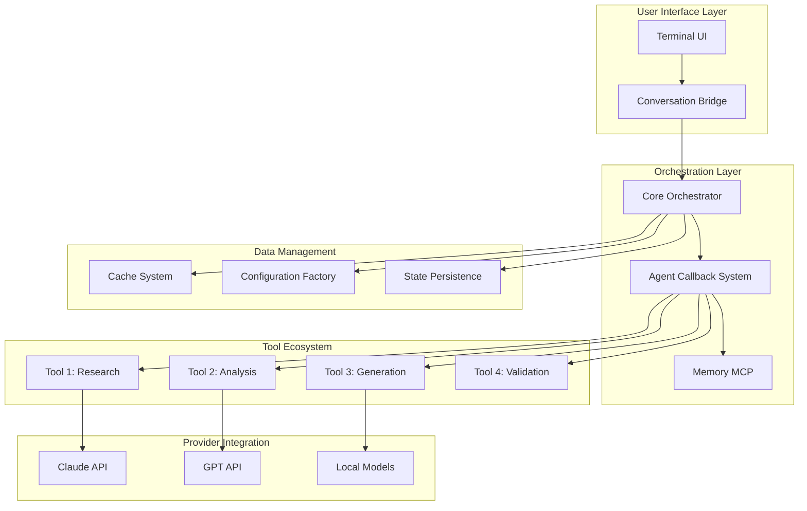
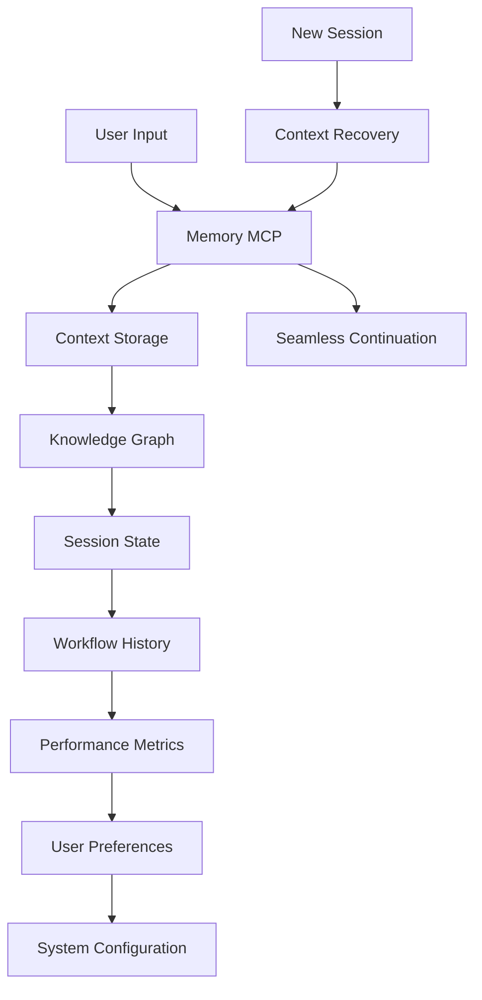
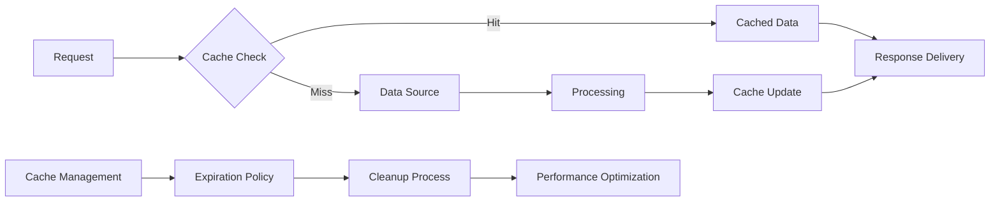

## Mao Application New User Flow  

> I sort of want to put the analytics trigger points throughout this flow. I'm going through that document now, and I don't think I can do both at once, so I'm noting it here in case you agree that it would make sense to do so. 
> Basically, this narrative format is supposed to serve as our 'ARCHITECTURE.md' file. So the more thorough we can be without jarring the flow, the less we'll have to fit into the documents in a different way. 
> Other than the documentation topics that have their own section files, which appears to be user memory system, user analytics, and system analytics, all of which I'm planning on making the first part of the business value section, just about everything else should be in this file as an opportunity to explain the architecture after the flow. We want to try to not integrate them too complete, but also still have them both in the same file. "Make a point" then "explain the architecture of that point" and repeat. Oh, also the visual identity UI section can hold its own architecture ... probably for the best since that needs to be the TypeScript and Node.js code so it is good to keep it separate for clarity. The "evolving" agentic timer is in the business value section as well (it is what the analytics work up to), but correct me if I'm wrong that we don't actually have any code implemented for that yet and thus no architecture to explain. 

### Getting Started 

You have a use-case to create a workflow for. Start the Mao application. 
  - By default Mao launches with the last session user's settings 
  - If that isn't you, you can launch with `--login` to enter your Username  
  - Or once the app is running, you in you can use `/login` to enter your Username 
  - If you've never used Mao before, you'll need to login and choose a couple settings 

```bash
mao mao # Proper startup command; launches the Mao application 
mao --login # Launches the login screen 
mao # Launches the app as if you're a new user 
mao --continue # Launches the app in the state of the last session (MCP memory one source of truth)
``` 

### Usernames versus User ID 

- A username is for UX; it is what Users type into the login screen 
- A user ID is created from the username and used on the backend 
- It will be displayed in a grayed-out and uneditable field below the username field 
- In the future, the User ID may provide another layer of security as analytics implementation is added 
- Specific usernames always populate the same user ID 
- User ID connects all workflows, use-cases, and other *data for that user*
- The custom User ID is created by a simple script that can also be run manually as a cli-command 

#### User ID Creation 

```bash
meid seanivore # Run command with the Username 
user-1642 # Response is that Username's User ID 
```

#### Forget Your Username? 

```bash
whoami # Run command with nothing else
> seanivore # Response is the username of the logged in user 
```

#### Meid Whoami Help 

```bash
> meid 
meid - Generate user IDs from usernames

Usage:
  meid username       Generate user ID for username
  meid -e username    Generate user ID with explanation
  meid -h             Show this help

Examples:
  meid seanivore      # user-1642
  meid -e alice       # user-1161 | Steps: 5 chars -> ...

Mathematical Operations:
  Uses character count, doubled count, and ASCII values
  Applies fibonacci, golden ratio, spiral, mirror, karmic operations
  Same username always produces the same user ID
```

### New User ID Application Background Setup 

- The application will create a new `./configs/user/username/user_username.json` directory and file
- "username" in the filename is the username: `user_seanivore.json`
- All user settings are saved to a subdirectory here 
- Initial settings are set to defaults
- Even default settings are recorded on this JSON file
- This ensures then when the app pulls up the JSON settings, it will show their actual settings regardless of them being default or not, eliminating a common UX issue of confusion (hello, VS Code)

#### User ID Application Session Startup 

- The application saves the state with the most recent User ID used
- Subsequent launches load with that ID and their settings 
- The application will allow users to adjust these settings at any time using `/config` or launching with `mao --config` which updates a subdirectory in their `./configs/user/username/` directory 

#### User ID & Workflow JSON Configs 

- New Workflows created by this User ID are not recorded to the User ID JSON file 
- However Orchestrator Management files easily can search a User ID or Username to pull up their workflows 
- All workflow JSONs have a User ID field, which is how they can be searched for by the application 
- They also have Workflow IDs which we'll get to shortly  

### Login Screen 

*App UI/UX* 

  - A minimalistic screen loads 
  - The welcome message persists throughout new user setup pages 
  - Most lines are bulleted; all bullets have large 3 space indent 
  - Priority visibility messages have no bullet or indent 
  - The `>` prompt is a visual indicator of the user's input 
  - The `●` is a primary message context from Mao 
  - Branched down `└` is a secondary context of the parent message 
  - Active help messages are `?` under the text input field 

```ui_login_id
╭─────────────────────────────╮
│ ~(=^‥^)  Mao welcomes you!  │
╰─────────────────────────────╯

●   What is your name?
    └ Please enter a username to continue 

╭────────────────────────────────────────────────────────╮
│ >                                                      │
╰────────────────────────────────────────────────────────╯
  ? 6-20 alpha-numeric characters
```

### Theme Selection 

*App UI/UX* 

  - This is **NOT** a new screen
  - If the User ID was recognized, the theme selection would not be shown
  - The app is a "one-screen" experience with irrelevant or dated info being removed for new info 
  - After login, the User is prompted to select a theme "that looks best in their terminal" 
  - The only things the termal actually changes is text colors (not main text color), use of white space, and character choices
  - As a user's message enters the conversation thread, the messages above the user's message may disappear; upward scrolling is reserved for essential content that needs to remain in our one-screen experience 

*The application UI uses semantic highlighting for cognitive leading and will be explained further in another section* 

  - The user's message is `>   seanivore` is always a faded gray text 
  - Any 3rd level context below a secondary `└` context, is also faded gray text 
  - 3rd level context is help text, much like the `?` under the text input field 
  - The `❯` is the user's input; move with up and down arrows and enter to select, this is intuitive and needs no explanation 
  - The `✔` is the user's selected input; it is a visual indicator of the user's selection 
  - The `1`, `2`, `3`, etc. are the options the user can select from 
  - The `Preview` is a visual representation of the user's selection; what they can expect to see from their selection 

```ui_login_theme
╭─────────────────────────────╮
│ ~(=^‥^)  Mao welcomes you!  │
╰─────────────────────────────╯

>   seanivore

●   Mao, seanivore!
    └ This is your first time here 

●   Choose a legible theme palette for your terminal. 
    └ We'll save your settings. We won't ask you again, mao. 
      Change this and other default settings with /config 

   1. Dark mode
   2. Light mode
 ❯ 3. Dark mode (CVD)✔
   1. Light mode (CVD)
   2. Dark mode (ANSI colors only)
   3. Light mode (ANSI colors only)


 Preview
 ╭───────────────────────────────────────────────╮
 │   1   standard ~(=^‥^) {                      │
 │   2 -    removed ("Bye, mao.");               │
 │   2 +    addition ("Mao!");                   │
 │   3   }                                       │
 ╰───────────────────────────────────────────────╯
```

### Primary Workspace View (Again, the same "page" in our one-screen experience) 

*App UI/UX* 

  - Once settings are complete, those messages clear and make way for the primary workspace view where everything happens
  - Collections of "Mao is ready to help!" are not 'CANNED' prepared in advance, per say, but rather we use the AI to prepare something unique in the moment; it is virutally always different for Users unless certain help or tips are being pushed 
  - The tips "Describe your workflow", "Ask a question", and "Share your goal" are all tips that can be prepared with many different messages to cycle through 
  - The /help option shows all of the available commands 
  - The /config option shows all of the current settings, which are still set to default 
  - The `>` bullet is a canned app message; same bullet as User messages, same color text  
  - The "Try" message has many different messages that cycle each time they see this screen

```
╭───────────────────────────────────────────────────╮
│ ~(=^‥^)  Mao is ready to help!                    │
│   user: seanivore                                 │
╰───────────────────────────────────────────────────╯


>   Say "hello" to Mao.
    ├ Describe your workflow 
    ├ Ask a question 
    └ Share your goal 


╭───────────────────────────────────────────────────╮
│ > Try "how do we start building?"                 │
╰───────────────────────────────────────────────────╯
  ? /help for help, /config to change settings
```

### Chatting with Mao To Create a Workflow 

*App UI/UX* 

  - This is the same screen as the image above 
  - When the User starts typing the prompt text above disappears 
  - Usage of a / would auto populate a list of possible commands to run 
  - Note that one might call it a "modal" but it has no casing, and scrolls through the prepared space for it 
  - The app has no wait UX; you can double text and interrupt Mao (or turn that off in app settings)
  - The `?` help message rotates to a new message that is context relevant; they are not created completely on the fly, but batches are prepared in advance around certain context to maintain the allway new feeling 
  - As they continue, the `?` would rotate more, showing `/tool-menu` and other tips
  - The test left in the input field is intended to show they were in the middle of typing 
  - As mentioned before, the `>` bullet is a canned app message; same bullet as User messages, same color text; below it shows an action that Mao took while working 

```
╭───────────────────────────────────────────────────╮
│ ~(=^‥^)  Mao is ready to help!                    │
│   user:  seanivore                                │
╰───────────────────────────────────────────────────╯


>   I need to put together a detailed research 
    report that breaks down the best practices
    for hiring new creative talent. 

>   I have a bunch of details in my notes 
    already 

●   Great idea, seanivore. 
    ├ Rattle off the details and I'll wait to reply
    └ Or say something like "lead me" and I'll take the lead 

>   Mao created a Workflow ID: uid-scw-965
    Workflow added to memory; workflow log created 


╭───────────────────────────────────────────────────╮
│ > some rough notes to                             │
╰───────────────────────────────────────────────────╯
  ? /variables to see what is needed 
```
```
  ? /help for help, /config to change settings 
  ? try /models or /tools to explore 
  ? share your /goal and Mao will do all the work 
  ? /workflow [custom_command] to continue a build 
  ? message /continue to find your last project 
  ? /workflow [custom_command] or [uid-abc-000] to continue a building workflow 
```

### Gathering Variables 

- The user and Mao can chat as casually or intentionally as they like 
- The user can ask for variables to be gathered 
- The user could provide the variables prepared in advance 

```bash
/variables # Shows the variables that are needed 
/variables-explain # Shows the variables that are needed with an explanation 
```

In the end, the only thing Mao **MUST** have is the workflow goal. The rest of the variables are 'optional' in that, Mao is fully capable of assessing the workflow goal and determining the best way to complete it. This is intended to create a quiet, but very flexable workflow creation experience. It should come naturally as the user just decides what to do or say. Mao has no script and only knows the variables requires and tool informtation, running parallell agents, etc. Many of the variables can be setup in the User's settings as defaults like the fallback models, providers, etc. 

### JSON Config File

| **VARIABLE**         | **DESCRIPTION**                                               |
| -------------------- | ------------------------------------------------------------- |
| user_id              | User ID of Username creating the workflow                     |
| workflow_id          | Workflow ID created at start of planning                      |
| custom_command       | Custom command to execute workflow                            |
| workflow_goal        | Goal statement of entire workflow project                     |
| workflow_deliverable | Final deliverables of entire workflow project                 |
| workflow_description | Description of workflow to complete project                   |
| phase_number         | Count of phases as they're added to workflow                  |
| phase_goal           | Goal statement of the phase's assigned task                   |
| phase_deliverable    | Deliverable of the phase's assigned task                      |
| phase_description    | Description of the phase's assigned task                      |
| resources            | Resources the agent can use to complete the phase's tasks     |
| tools                | Tools the agent can use to complete the phase's tasks         |
| model_1              | Choice model to be the agent of this phase                    |
| model_2              | Backup model agent should choice agent be unavailable         |
| model_3              | Fail-safe model agent should choice and backup be unavailable |
| provider_1           | Provides for the choice model                                 |
| provider_2           | Provider for the backup model                                 |
| provider_3           | Provider for the fail-safe model                              |
| handoff_number       | Count of the handoffs as they're added to the workflow        |
| assessment_questions | Questions to assess if the deliverable is complete            |
| human_in_loop        | Whether the orchestrator should get human feedback            |

### Workflow ID 

- When you create a workflow alone or with Mao's help, the JSON object will need a workflow ID 
- Orchestrator Management files can search a User ID or Username to pull up their workflows 
- These are also used by Mao in their MCP memory one source of truth to pull back up the workflow details when returning to the workflow as a new instance 
- Run the `uid` command to get a collision-free (never repeated) unique ID --> `uid-abc-000` 
- Later, you can follow the `--workflow` command with this ID for that workflow's details, though the custom command might be easier to remember 

```bash 
uid # Creates a new unique Workflow ID 
mao --workflow uid-abc-000 # Shows workflow details 
/uid # Creates a new unique Workflow ID 
/workflow uid-abc-000 # Shows workflow details 
```
- Math is used to create the ID; if you are curious or need to create a handful of UIDs, the -h flag for "HELP" will show you more information you can find. 

```bash 
> uid -h # Help message 
uid - Generate unique workflow IDs

Usage:
  uid              Generate a single UID
  uid -e           Generate UID with mathematical explanation
  uid -b N         Generate N UIDs in batch
  uid -h           Show this help

Examples:
  uid              # uid-abc-123
  uid -e           # uid-abc-123 | Math: a(456)=473 → b(473)=419 → c(419)=396
  uid -b 5         # Generate 5 UIDs

Mathematical Operations:
  Each letter represents a mathematical operation:
  a=add, b=multiply, c=subtract, d=divide, e=power, f=fibonacci
  g=golden_ratio, h=hash, i=invert, j=jump, k=karmic, l=logarithmic
  m=mirror, n=nine_mult, o=orbit, p=prime_like, q=quadratic, r=reverse_add
  s=spiral, t=triangle, u=unity, v=vortex, w=wave, x=xor, y=yield, z=zenith
```

### Three Workflow JSON Config Schemas

The config schemas have been broken into three JSON objects. This is to simplify the fact that Mao is a multi-agent system, and is modular. Changes to workflows means that they different objects shouldn't be pre-attached. Agents might run agents in parallel, or in series, or in a mix of both. 

NOTE: It is VERY common and highly encouraged that Mao leave the final phase of workflows that deal with creative subject matter completely open. When the Agent completes their deliverable, Mao is able to assess it on the spot and make a decision as to what the next step in the flow should be. This is pushed heavily because it is so very natural to how a human would do it on their own. 

Similarly, Mao may decide the Agent's deliverables are not acceptable; not up to par. In this case they may use a command to change the workflow instead up updating it, though the result is similar, a new agent is tasked and called and the flow continues until completion. 

* **TEMPLATES FOR REFERENCE:** 

  - WORKFLOW: `./templates/workflows/example-workflow_workflow_config.json`
  - PHASE: `./templates/workflows/example-workflow_phase_config.json`
  - HANDOFF: `./templates/workflows/example-workflow_handoff_config.json`
  - HELPER: `./templates/workflows/README.md`

#### **WORKFLOW** JSON Object 

- This is the first JSON object that is created when a workflow is created 
- It contains the workflow's goal, deliverable, description, and other details 
- Each project's workflow has only one workflow JSON object 
- The 'goal', 'deliverable', and 'description' are all items that will be broken down into the phases 
- The objects are tied together by the workflow_id 
- While building the workflow, the temp_directory is used to store the JSON objects, the management of this file is explained later

```json
{
  "workflow": [
    {
      "user_id": "user-0663",
      "workflow_id": "uid-qmt-465",
      "custom_command": "marketing strategy startup",
      "workflow_goal": "Create comprehensive marketing strategy for my fintech startup",
      "workflow_deliverable": "Marketing strategy report",
      "workflow_description": "Identify what is needed to complete the goal. Build a workflow that delegates the work to the appropriate agents, having them work in parallel if needed. Leave the last phase opened-ended. Detail that handoff before the last phase with a list of questions Orchestrator will use to assess if the deliverable is complete, and if not, what is needed to complete it.",
      "temp_directory": "configs/workflows/.temp/marketing-strategy-startup/"
    }
  ]
}
```

#### **PHASE** JSON Object 

- This is the second JSON object that is created when a workflow is created 
- It contains a task needed to be completed to achieve the workflow's goal 
- Just like the workflow, each phase has a goal, deliverable, description, and specific details for the agent 
- The objects are tied together by the workflow_id 
- Phases are numbered sequentially, starting with 01, 02, 03, etc. 
- If there are agents running in parallel, they will share the same phase_number, appended with an underscore and a letter, a, b, c, etc. 

```json
{
  "phase": [
    {
      "workflow_id": "uid-qmt-465",
      "phase_number": "01",
      "phase_goal": "Market research",
      "phase_deliverable": "Market research report",
      "phase_description": "Research target market. Explore demographics in all socioeconomic status ranges, all geo-locations, all education level, but only females, married, and with a birthday coming up in the next 5 months. Research competitors; detail their marketing strategy.",
      "resources":[
        "./directory/folder/file.md",
        "https://file.com/folder"
      ],
      "tools": ["web_search", "text_editor"],
      "model_1": "claude-sonnet-4",
      "model_2": "claude-sonnet-3.7",
      "model_3": "claude-sonnet-3.5",
      "provider_1": "requesty",
      "provider_2": "anthropic direct",
      "provider_3": "anthropic direct"
    }
  ]
}
```

#### **HANDOFF** JSON Object 

- This is the third type of JSON object that is created when a workflow is created 
- This is created while building the workflow as part of the creative process 
- When the assessment is being discussed, it is important to get it written down in real time 
- This object also helps provide important indicators to the orchestrator or the User watching the workflow 
- For example, if there is a human in the loop, the orchestrator will need to know when to get human feedback 
- Additionally, the handoff object is important when the subsequent phases have been left open-ended, where the handoff object is used as a placeholder and indicator that the Orchestrator needs to make a decision and then build the rest of the workflow accordingly 
- Note that there might be more than one phase created after a handoff, there is no hard rule 

```json
{
  "handoff": [
    {
      "workflow_id": "uid-qmt-465",
      "handoff_number": "01",
      "assessment_questions": [
        "How can I assess if this deliverable is complete?",
        "What is needed to complete that assessment?",
        "Do I have what I need to complete the assessment?"
      ],
      "human_in_loop": "no"
    }
  ]
}
```
### Workflow Updates 

As mentioned, in cases where the workflow is left open-ended, the Orchestrator will create additional phases as needed, included potential handoffs in between each of the phases. The separated, modularity of the JSON objects makes this easy to do on the fly. All of the JSON objects are properly labeled so that they do not need to be created in a single file. In fact, each type of JSON object may best be created as separate files from the start and stored in the same WORKFLOW directory which will end up being auto created. 

### The Setup Script

*Deals with our temporary JSON Object Directory* 

- During workflow creation, the JSON objects are saved in a temporary directory 
- A sub-directory is created in the temporary directory named for the use-case 
- See: `./configs/workflows/.temp/use_case_name/`
- The Setup Script will create final JSON objects in the final location and delete the temp files 

### Command Naming Conventions 

The custom command created for the workflow, named for it's use-case, has a carefully structured name which is used across the entire collection of workflow assets. This include the following, which will be illustrated in a structured example below the command writing protocol. As mentioned before, it will likely be the most memorable part of the workflow for the User. 

That same command is used in the following naming structures to tie everything together: 

  - Temporary JSON object sub-directory name `./configs/workflows/.temp/use_case_name/`
  - Permanent workflow directory name `./configs/workflows/use_case_name/`
  - Workflow JSON object sub-directory file name `./configs/workflows/use_case_name/use_case_name_workflow_config.json`
  - Execution script file name `./configs/workflows/use_case_name/use_case_name.sh`
  - README.md file name `./configs/workflows/use_case_name/README_use_case_name.md`

#### Command Writing Protocol 

  - A custom command should be 2 to 3 words long 
  - It is important to keep the command short and concise 
  - Write it in reverse drill-down order, starting with the broadest category term 
  - It often feels like you are writing the intent of your project workflow in reverse
  - Mimic the structure of commands that we're used to already, like `git commit` or `git push`

- **EXAMPLE** I'm creating a workflow for a project in which I need to research, analyze, and create a marketing strategy report for my fintech startup, 'Dog-Tech' 

  1. The command is technically just the first, broadest category term: `marketing`
     - Other workflows in marketing can be created with the same first command word
     - This will make working on various related marketing projects easier 
     - It will make remembering commands easier
  2. For the second word, use a subcategory of marketing: `strategy`
     - This is the argument to the marketing command 
     - It is also likely that there will be other marketing strategy workflows
     - This will make it easier to find the right command 
  3. For the third word, I'm just going to drill down more: `report`
     - This makes it extrememly memorable 
     - It also makes it clear for future workflow creation that this might be a workflow that can easily be repurposed for marketing strategy reports on other startup ideas 
     - The workflow can be reused in the future simply by updating the JSON objects and running the setup script again 

The idea here is that, if in the future I need to create another marketing strategy report, I can use the same command, and just adjust the workflow to include an $ARGUMENT. Not necessary for the first workflow, where it would be dog-tech, but a good habit to get into. 

It isn't a perfect science. The conceptual reasoning is more important to understand rather than the exact rules as defined above. For example, for something as common as *creating a marketing strategy report* and for a popular command like *marketing* I would probably abbreviate, with the goal of making something easier to type, easier to be longer, but still easy to make simple for each specific use-case. 

- **TWO FINAL STEPS** 

  1. Type the command a few times to make sure it is easy to type 
     - I like abbreviating mkt because it is well known and easy to type  
     - I like keeping strategy it keeps thing clear and easy to understand  

```bash
mkt strategy report # This is the command 
``` 

  2. Take the first word, the actual command, and run it in the terminal 
     - It will be colored (mine is green) if it is already being used 
     - If it isn't colored, or to double check, use `which` before the command to confirm if it is/isn't being used 

```bash 
mkt # This is the command 
zsh: command not found: mkt # This is the output telling me nothing is using the command 
```
```bash
which mkt # This is the command 
mkt not found # This is the output telling me nothing is using the command 
```

- **THE FORMULA** 

```bash
command category variant   # This is the command 
```

| **COMMAND** | **CATEGORY** | **VARIANT**  | **DESCRIPTION**                                |
| ----------- | ------------ | ------------ | ---------------------------------------------- |
| mkt         | strategy     | dogtech      | Research strategy for Dog-Tech startup         |
| mkt         | content      | plan         | Social content plan for Dog-Tech startup       |
| job         | app          | resume       | Create targeted resume for job applications    |
| job         | app          | cover-letter | Create cover-letter for job applications       |
| job         | app          | doc          | Create cover-letter and resume for job app     |
| tag         | keyword      | t-shirts     | Come up with SEO keywords for my t-shirt store |
| social      | caption      | ig           | Write Instagram captions                       |

#### Command Writing Rules 

**Always avoid** these in a command:

  1. No plural (so you never have to wonder if it is singular or plural)
  2. No present participle verbs (gerunds with helping verbs)
  3. No punctuation like hyphens (standard UX expectation)
  4. No past tense verbs (e.g. `wrote`, `finished`, just stick to one tense)

**Always use** these in a command: 

   1. Use the simplest grammatical form of the word 
   2. Use present tense 
   3. Abbreviate when it is sensible 
   4. Be short and concise 

**Always remember** these should be helpful for humans to remember and use. 

### Setup Script Automations 

When the workflow is created, you need to run the JSON config file(s) through the setup script. This will create the following: 

1. Create a new directory in the `configs/workflows/command_use_case/` directory 
2. Place a new JSON config file in the new directory 
   - Built from the .temp directory 
   - Then deletes the .temp directory 
3. Produces a README.md file in the new directory 
   - Describes the workflow
   - Reminds the user how to activate the workflow 
   - Also creates categorical tags about the workflow project to be used in analytics 
4. Creates executable script with all the details of the workflow 
   - This is the script that will be used to run the workflow 
   - Finally, we have a script that is specific and not generic 
5. Make the script executable using the custom command 
   - Creates it using the tool `chmod +x` 
   - Script runs `chmod +x ./configs/workflows/command_use_case/command_use_case.sh` 
   - Saves the command to your ~/bin directory 
6. Creates new sub-directories for 
   - Deliverables 
   - Metadata 
   - **This is all automated**

**NOTE:** It is important to remember that the drafting documents used in the workflow are kept in the Files API and not passed along with the deliverables. If you NEED draft documents, you will need to list them as deliverables. 

#### Workflow Directory Structure

  - Automatically created by the setup script 
  - Command naming structure across files 

```
configs/workflows/command_use_case/
├── config-files/                                 # Directory for JSON config files 
│   ├── command_use_case_workflow_config.json     # Workflow JSON config file 
│   ├── command_use_case_phase_config.json        # Phase JSON config file 
│   └── command_use_case_handoff_config.json      # Handoff JSON config file 
├── README_command_use_case.md                    # Auto-generated usage guide
├── command_use_case.sh                           # Auto-generated use-case specific script that your command activates 
├── metadata/                                     # Workflow tracking details  
│   ├── command_use_case_memory.json              # Workflow Memory MCP File  
│   └── command_use_case_log.json                 # Workflow log file 
└── deliverables/                                 # Final outputs; this is where the deliverables are stored 
    └── command_use_case_report.md                # This is the final deliverable; it is the report 
```

### Using The Setup Script 

1. This is located here: `./scripts/workflow_setup/workflow_setup.sh`  
2. The initial JSON objects will be in a temp directory 
   - The script should use them and create the final JSON objects in the new directory 
   - Then delete the temp directory 
   - The temp directory name will be the same as the command use-case directory name 
   - E.g. `./configs/workflows/.temp/command_use_case/`
   - I.e. it should be able to run with a directory as the argument instead of specifically a JSON config file only
   - It also needs to be able to run with a JSON config file as the argument 
   - Most importantly, the JSON objects may be in separate files in the directory 
   - **NOTE** let's set it up so that the executable setup script can be run from anywhere (i.e. not just from the root directory, not in the .temp directory; remember it will also be run from the application as a slash command) -- As such, let's make it so that it understands the path to the temp directory and all we need to add is `./command_use_case/` for example. 
3. The script itself should be made executable using a custom command defined in the CLI configs 

```bash 
mao --setup ./command_use_case/ # This is the command and the argument is the directory with all the JSON objects  
/setup ./command_use_case/ # This is the slash command with JSON object directory argument 
```

### Application Configuration Settings 

*App UI/UX* 

  - Users are quietly prompted to adjust configuration settings 
    - Via the `?` message mentioning they try /config
    - This /help and /config are persistent 
    - Always the first `?` messages on the primary workspace page each time it is loaded  
  - Settings below are those same settings saved to the `user_username.json` 
  - The 'Description' is only displayed when the user's selector `❯` is on the setting 
  - 'Description' shows the meaning of the selected setting
  - Place selector on the other options for hover display to show their meanings 
  - Selecting a setting will allow the user to toggle between the other options, usually by opening a modal

| **SETTING**       | **DEFAULT**         | **DESCRIPTION**                                      |
| ----------------- | ------------------- | ---------------------------------------------------- |
| Quick launch      | `always`            | Launch app with last user logged in                  |
| Favorite model    | `claude-sonnet-4`   | Use for workflows unless discussed                   |
| Default provider  | `anthropic direct`  | I prefer this provider; discuss to change            |
| Theme             | `dark mode CVD`     | Dark computer theme; use high legibility colors      |
| Tone notification | `one time, no push` | When a workflow is complete, a simple tone is played |
| Cat vibes         | `I love it`         | We'll meow it up for you                             |
| Double-texting    | `always`            | Interrupt Mao like any messenger experience          |

### Quick Launch Options 

1. `always` - Launch app with user from last session, unless logged out
2. `off` - Load Username login on every startup 
3. `continue only` - Launch `mao --continue` to skip login, otherwise load Username login 

### Favorite Model 

- Any model can be added using nickname or full name 
- Startup `mao --model` or `/model` to set favorite model 
- Startup `mao --model-list` or `/model-list` to see all available models 

### Default Provider 

- Any provider can be added using nickname or full name 
- This is helpful for Users who have a bunch of cash in a specific API provider 
- Startup `mao --provider` or `/provider` to set default provider 
- Startup `mao --provider-list` or `/provider-list` to see all available providers 

### Cat Vibes 

- We don't want to be too annoying with our cat branding 

  1. `I love it` - We'll meow it up for you 
  2. `mao and then` - Adequate but not too much meowing 
  3. `be serious pls` - No meowing at all 

### Double-texting 

1. `always` - Interrupt Mao like any messenger experience 
2. `never` - One reply at a time for each party  

### Tone Notification 

1. `once, no push` - When a workflow is complete, a simple tone is played, no push notification 
2. `silent, push` - When a workflow is complete, no tone is played, but a push notification announces completion 
3. `no notifications` - No tone is played, no push notification 

**MODULAR MAGIC:** Have a new setting for the application? Either as Mao what files are needed, or of them to help create them, or check the templates directory. PLUG-AND-PLAY. New files in their proper place is all that is needed to, for example, add a new setting that says "bark like a dog when workflow is done y/n?". Magic. 

---

# SECTION II: QUICK REFERENCE & ARCHITECTURE
*Technical Foundations with Visual Diagrams*

---

## Chapter 2.1: Complete File Touchpoints Diagram

### The Mao Ecosystem Overview

**Mao's modular architecture** is built on **dynamic discovery patterns** - the system automatically finds and integrates components without hardcoded mappings.



### Directory Structure and Component Relationships

**Core Directory Organization:**
```
modular-agent-orchestrator/
├── tools/                    # Modular tool ecosystem
│   ├── research_tool/
│   │   ├── logic.py         # Core functionality
│   │   ├── button_research.py    # UI integration
│   │   ├── ui_research.py        # Interface components
│   │   └── research_tool.json    # Configuration
│   └── [11 other tools following same pattern]
├── orchestrator/            # Core coordination system
│   ├── core.py             # Main orchestration logic
│   ├── agent_callback.py   # Agent coordination
│   └── conversation_bridge.py    # UI communication
├── configs/                 # Dynamic configuration system
│   ├── user/               # User-specific settings
│   ├── models/             # Model configurations
│   ├── providers/          # Provider integrations
│   └── workflows/          # Workflow templates
└── .claude/                # CLI command system
    └── commands/           # Custom command definitions
```

### Key Integration Patterns

#### **4-File Tool Structure**
Every tool follows the consistent pattern:
- **`logic.py`**: Core functionality and business logic
- **`button_*.py`**: UI integration and user interactions
- **`ui_*.py`**: Interface components and visual elements
- **`*.json`**: Configuration and metadata

#### **3-File CLI Command Structure**
Custom commands use:
- **`command.py`**: Core command logic
- **`ui_command.py`**: User interface handling
- **`command.json`**: Command configuration and metadata

---

## Chapter 2.2: Template System & Configuration Factory

### Dynamic Configuration Generation

**The Problem Mao Solves**: Traditional AI tools require manual configuration of every combination of model, provider, and tool. Mao's **Configuration Factory** generates any needed configuration on demand.

#### **Configuration Templates**

**Tool Configuration Template:**
```json
{
  "name": "{tool_name}",
  "version": "1.0.0",
  "description": "{tool_description}",
  "dependencies": [
    "CacheManager",
    "@handle_errors",
    "estimate_cost"
  ],
  "providers": ["any"],
  "models": ["any"],
  "input_schema": {
    "type": "object",
    "properties": {
      "goal": {"type": "string"},
      "context": {"type": "object"}
    }
  },
  "output_schema": {
    "type": "object",
    "properties": {
      "result": {"type": "string"},
      "metadata": {"type": "object"}
    }
  }
}
```

**Model Configuration Template:**
```json
{
  "name": "{model_name}",
  "provider": "{provider_name}",
  "api_endpoint": "{endpoint}",
  "capabilities": [
    "text_generation",
    "analysis",
    "coding"
  ],
  "cost_per_1k_tokens": {
    "input": "{input_cost}",
    "output": "{output_cost}"
  },
  "context_window": "{context_size}",
  "rate_limits": {
    "requests_per_minute": "{rpm}",
    "tokens_per_minute": "{tpm}"
  }
}
```

#### **Drop-In/Drop-Out Modularity**

**Adding New Components:**
```bash
# Add new tool
mao add-tool research_assistant
# Automatically generates:
# - logic.py with standard patterns
# - button_research_assistant.py
# - ui_research_assistant.py  
# - research_assistant_tool.json

# Add new model
mao add-model claude-4 --provider anthropic
# Automatically generates:
# - Model configuration
# - Provider integration
# - Cost estimation setup
```

**Removing Components:**
```bash
# Remove tool (zero breaking changes)
mao remove-tool old_research
# Automatically:
# - Removes tool files
# - Updates configurations
# - Maintains workflow compatibility

# Remove provider (graceful degradation)
mao remove-provider old_api
# Automatically:
# - Redirects to fallback providers
# - Updates cost calculations
# - Preserves workflow functionality
```

### Template Inheritance System

#### **Base Templates**
- **Tool Base**: Standard patterns for all tools
- **Command Base**: CLI command foundations
- **Workflow Base**: Business process templates
- **Provider Base**: API integration patterns

#### **Specialized Templates**
- **Research Tools**: Web scraping, data analysis
- **Generation Tools**: Content creation, code generation
- **Analysis Tools**: Data processing, pattern recognition
- **Validation Tools**: Quality assurance, testing

#### **User Templates**
- **Custom Workflows**: User-defined process templates
- **Business Templates**: Industry-specific patterns
- **Integration Templates**: Third-party service connections

---

## Chapter 2.3: Modular Architecture Deep Dive

### The 11-Tool Ecosystem

**Current Production Tools:**
1. **Research Tool** - Web scraping and data gathering
2. **Analysis Tool** - Data processing and insights
3. **Generation Tool** - Content and code creation
4. **Validation Tool** - Quality assurance and testing
5. **Integration Tool** - Third-party service connections
6. **Workflow Tool** - Process orchestration
7. **Monitoring Tool** - System health and performance
8. **Optimization Tool** - Performance enhancement
9. **Security Tool** - Privacy and compliance
10. **Analytics Tool** - Usage tracking and insights
11. **Coordination Tool** - Multi-agent management

### Orchestrator Management Layer

#### **Core Orchestration Engine**

**`core.py` Responsibilities:**
- **Goal interpretation** and workflow planning
- **Resource allocation** and optimization
- **Quality assurance** and error recovery
- **Performance monitoring** and reporting

**`agent_callback.py` Responsibilities:**
- **Agent selection** based on capabilities
- **Task distribution** and load balancing
- **Progress tracking** and status updates
- **Result aggregation** and validation

**`conversation_bridge.py` Responsibilities:**
- **Natural language processing** for user input
- **Intent recognition** and goal extraction
- **Response formatting** and user communication
- **Session management** and context preservation

#### **Memory MCP as Single Source of Truth**

**Memory Architecture:**


**What Gets Stored:**
- **Conversation context** and user preferences
- **Workflow definitions** and execution history
- **Performance metrics** and optimization data
- **Error patterns** and resolution strategies
- **Cost tracking** and budget management
- **Quality assessments** and improvement recommendations

**Recovery Capabilities:**
- **Session restoration** after disconnection
- **Context preservation** across tool switches  
- **Learning retention** from previous interactions
- **Preference persistence** for user experience
- **Performance optimization** based on history

---

## Chapter 2.4: Data Flow Illustrations

### Technical Flows Showing HOW the Magic Happens

#### **Workflow Execution Data Flow**

```mermaid
graph LR
    A[User Goal: "Analyze Competitors"] --> B[Intent Parser]
    B --> C[Tool Selection Engine]
    C --> D[Agent Coordination Layer]
    D --> E[Web Research Agent]
    D --> F[Analysis Agent]
    D --> G[Report Generation Agent]
    E --> H[Raw Data Collection]
    F --> I[Structured Analysis]
    G --> J[Formatted Report]
    H --> K[Data Aggregation]
    I --> K
    J --> K
    K --> L[Deliverable: Competitor Analysis Report]
```

**Information Journey:**
1. **User Input**: Natural language goal description
2. **Intent Parsing**: Extract actionable requirements
3. **Tool Selection**: Choose optimal agents for task
4. **Agent Coordination**: Distribute work efficiently
5. **Parallel Execution**: Multiple agents work simultaneously
6. **Data Integration**: Combine results intelligently
7. **Quality Assurance**: Validate output quality
8. **Delivery**: Present results to user

#### **Cache Performance Pipeline**



**Performance Benefits:**
- **Instant responses** for repeated queries
- **Cost reduction** through result reuse
- **Load balancing** across providers
- **Quality consistency** through verified results

#### **Error Handling and Recovery Flow**

```mermaid
graph TD
    A[Operation Start] --> B{Error Occurs?}
    B -->|No| C[Successful Completion]
    B -->|Yes| D[@handle_errors Decorator]
    D --> E[Error Classification]
    E --> F{Recoverable?}
    F -->|Yes| G[Automatic Recovery]
    F -->|No| H[Graceful Degradation]
    G --> I[Retry Operation]
    H --> J[Alternative Approach]
    I --> K[Success Notification]
    J --> K
    K --> L[Continue Workflow]
```

**Error Handling Benefits:**
- **Automatic recovery** for transient issues
- **Graceful degradation** when services unavailable
- **User notification** without system crashes
- **Learning integration** to prevent future issues

#### **Cost Estimation and Monitoring**

```mermaid
graph LR
    A[Workflow Request] --> B[estimate_cost()]
    B --> C[Resource Requirements]
    C --> D[Provider Pricing]
    D --> E[Total Estimate]
    E --> F{Budget Check}
    F -->|Approved| G[Execute Workflow]
    F -->|Over Budget| H[Optimization Suggestions]
    G --> I[Real-time Monitoring]
    H --> I
    I --> J[Actual Cost Tracking]
    J --> K[Budget Updates]
```

**Cost Management Benefits:**
- **Predictable pricing** before execution
- **Budget protection** against overruns
- **Optimization suggestions** for cost reduction
- **Real-time monitoring** during execution

### Architecture That Enables Revolutionary Concepts

**Why This Architecture Matters:**

#### **Scalability**
- **Horizontal scaling** through modular components
- **Vertical optimization** through intelligent caching
- **Load distribution** across multiple providers
- **Resource efficiency** through smart coordination

#### **Reliability**
- **Zero breaking changes** through modular design
- **Automatic failover** between providers
- **Comprehensive error handling** at every level
- **State preservation** across system updates

#### **Extensibility**
- **Plugin architecture** for easy tool addition
- **Template system** for rapid customization
- **API integration** for third-party services
- **Configuration flexibility** for diverse use cases

#### **Performance**
- **Parallel execution** across multiple agents
- **Intelligent caching** for repeated operations
- **Cost optimization** through smart routing
- **Real-time monitoring** for continuous improvement

---

**The Technical Foundation is Solid**: This architecture proves that the revolutionary concepts in Mao are built on enterprise-grade technical foundations, not theoretical possibilities.

*Ready to see how users actually interact with this powerful system?*