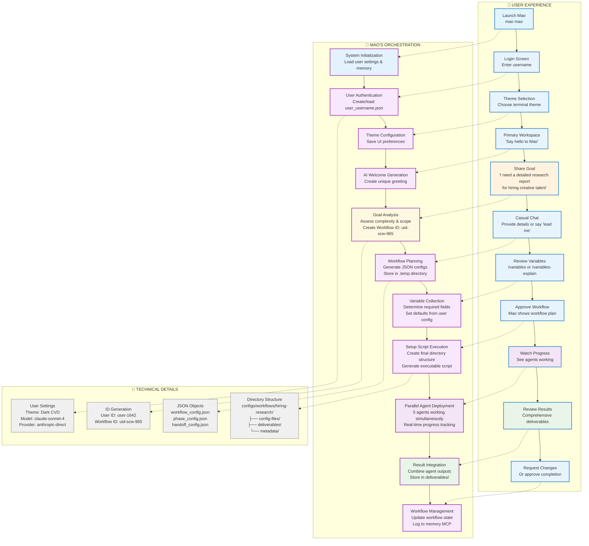
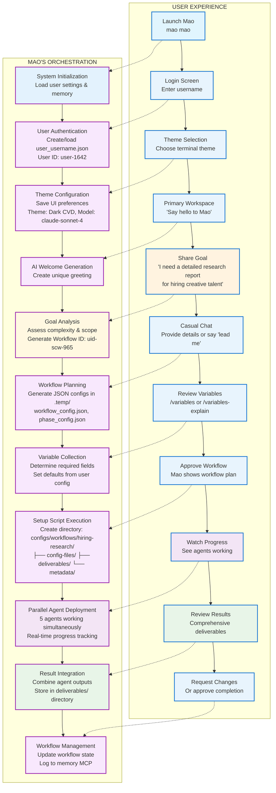
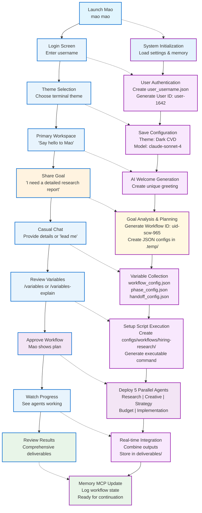
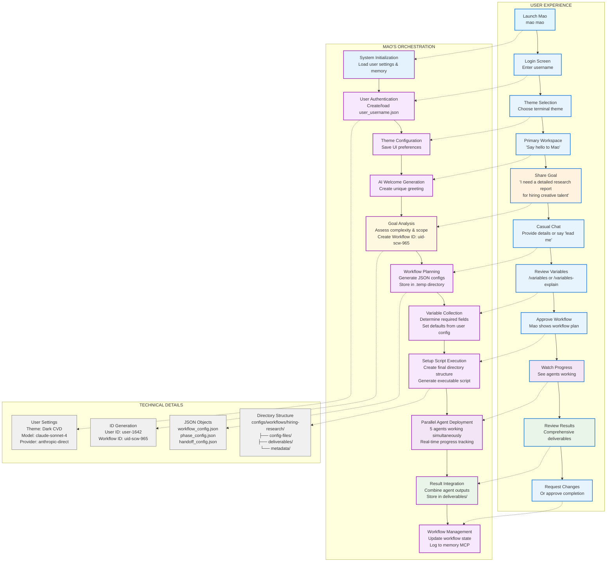
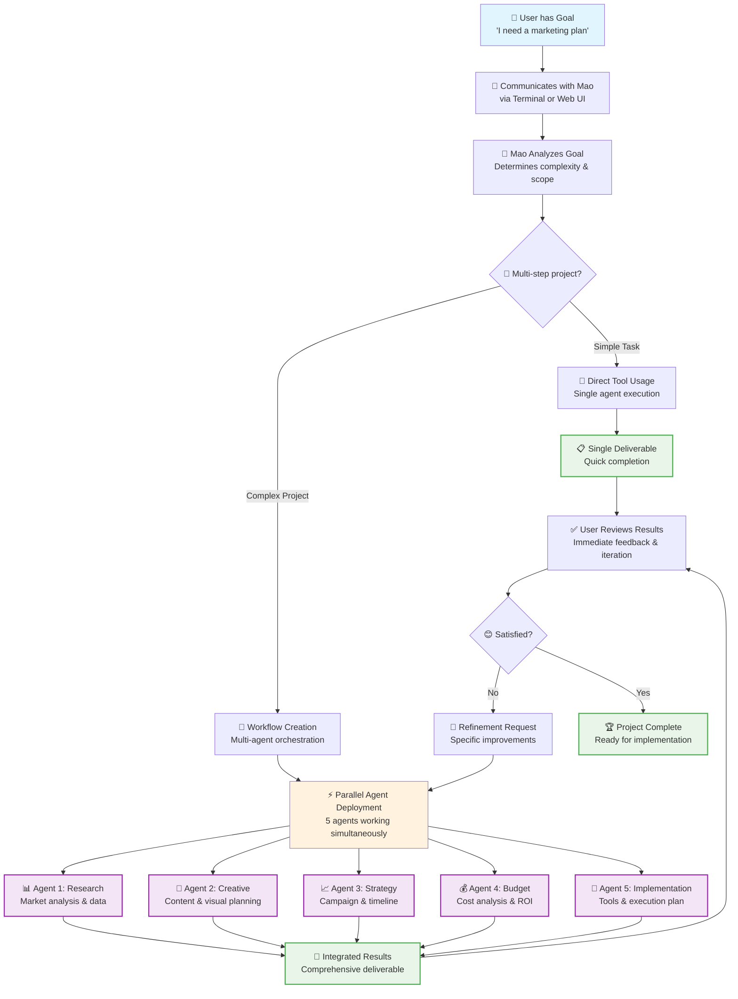
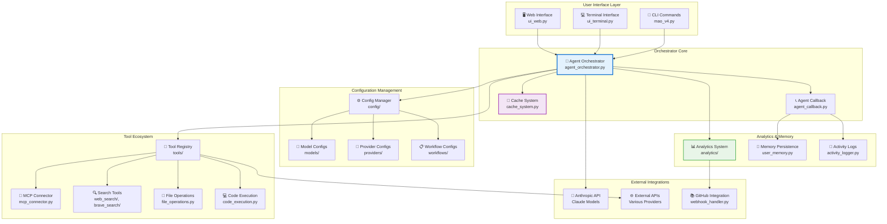
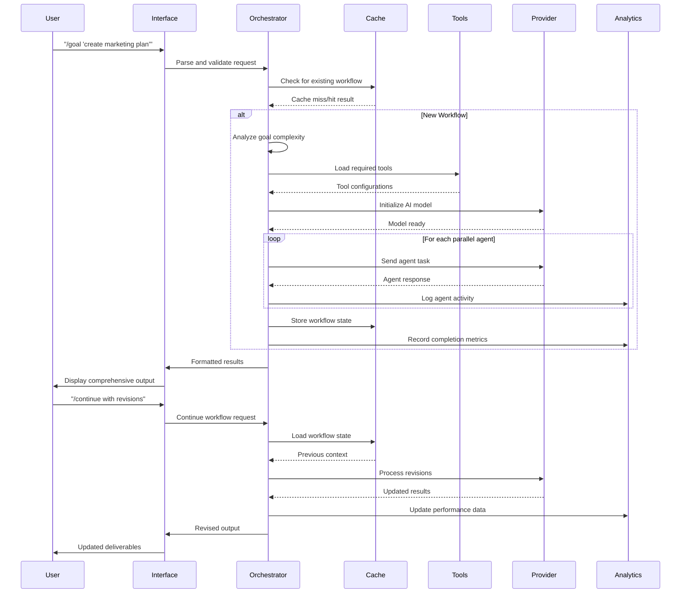
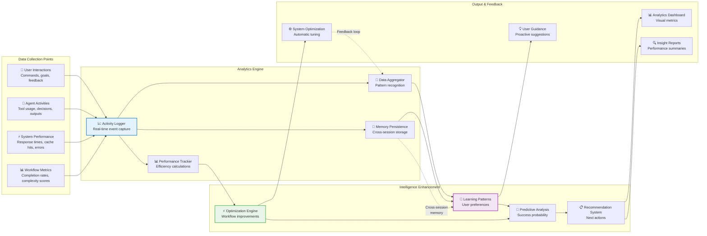

# Mermaid Diagrams for Documentation

This file contains all the Mermaid diagrams used throughout the Mao documentation. Copy and paste these directly into the relevant documentation files.

## Dual-Perspective User Journey Flow (Vertical with Emojis)
*For use in: 03_USER_FLOW.md - Shows both user experience and Mao's orchestration*



## Dual-Perspective User Journey Flow (Integrated Technical Details)
*Technical details integrated into the main flow for better readability*



## Streamlined Dual-Flow (Ultra Clean)
*Simplified version with technical details inline*



## Dual-Perspective User Journey Flow (Clean - No Emojis)
*Alternative version matching Mao's minimal app aesthetic*



## Simple User Journey Flow (Alternative)
*For use when you want a simpler version focusing just on the core workflow*



## System Architecture Overview
*For use in: 06_ORCHESTRATION.md*



## Data Flow Sequence Diagram
*For use in: 05_INTERFACE.md*



## Memory & Analytics Integration
*For use in: 07_ANALYTICS_MEMORY.md*



---

## Usage Instructions

1. **Copy the entire mermaid code block** (including ```mermaid and ```)
2. **Paste directly into markdown files** where you want the diagram to appear
3. **GitHub Pages with Jekyll** will automatically render these as interactive diagrams
4. **Customize colors and styling** by modifying the `style` and `classDef` lines

## Additional Diagrams Needed

- **Tool Integration Flow** - How button snippets are created and used
- **Cross-Session State Management** - Memory persistence between sessions  
- **Multi-Instance Communication** - How multiple Mao instances could coordinate
- **Security & Privacy Flow** - Local vs cloud processing visualization