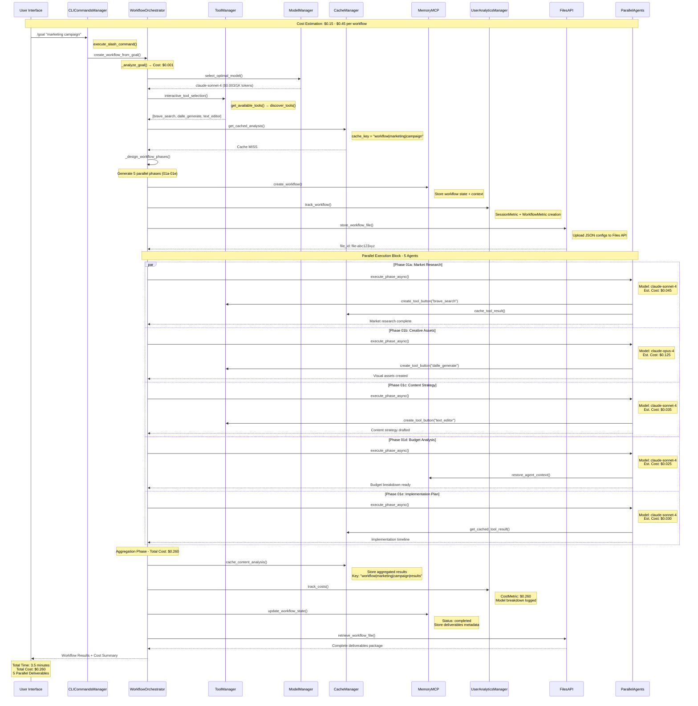

# Technical Data Flow Through System
*For use in: 05_INTERFACE.md - Complex technical flow for engineers to drool over*

## Complete System Data Flow with Cost Tracking

## Detailed Component Communication Flow

```mermaid
graph TB
    subgraph "Request Processing Layer"
        A[User Input] --> B[CLICommandsManager.execute_slash_command]
        B --> C[Input Validation & Parsing]
    end
    
    subgraph "Orchestration Layer"
        C --> D[WorkflowOrchestrator.create_workflow_from_goal]
        D --> E[WorkflowOrchestrator._analyze_goal]
        E --> F[WorkflowOrchestrator._design_workflow_phases]
        F --> G[WorkflowOrchestrator.execute_workflow_async]
    end
    
    subgraph "Resource Management Layer"
        H[ModelManager.select_optimal_model] 
        I[ToolManager.get_available_tools]
        J[ToolManager.interactive_tool_selection]
        K[CacheManager.get_cached_analysis]
        L[CacheManager.cache_content_analysis]
    end
    
    subgraph "Execution Layer"
        M[AgentOrchestrator.coordinate_agent_handoff]
        N[AgentOrchestrator.execute_workflow_phase]
        O[ButtonManager.create_tool_execution_snippet]
        P[Real-time Progress Tracking]
    end
    
    subgraph "Persistence Layer"
        Q[MemoryMCP.create_workflow]
        R[MemoryMCP.update_workflow_state]
        S[FilesAPI.store_workflow_file]
        T[FilesAPI.retrieve_workflow_file]
    end
    
    subgraph "Analytics Layer"
        U[UserAnalyticsManager.track_session]
        V[UserAnalyticsManager.track_workflow]
        W[UserAnalyticsManager.track_costs]
        X[SystemAnalyticsManager.track_performance]
    end
    
    %% Flow connections with annotations
    D -.->|"Cost: $0.001"| H
    D -.->|"Discovery"| I
    E -.->|"Cache Check"| K
    F -.->|"Store Config"| Q
    G -.->|"5 Parallel Phases"| M
    M -.->|"Per Phase"| N
    N -.->|"Button Gen"| O
    G -.->|"Results Cache"| L
    G -.->|"State Update"| R
    G -.->|"File Storage"| S
    
    %% Analytics connections
    D -.->|"Session Start"| U
    G -.->|"Workflow Track"| V
    G -.->|"Cost Track"| W
    N -.->|"Performance"| X
    
    %% Cost annotations
    H -.->|"$0.003-0.015/1K"| D
    N -.->|"$0.025-0.125/phase"| G
    L -.->|"Free (local)"| G
    S -.->|"$0.001/file"| G
    
    %% Styling for technical audience
    classDef orchestration fill:#e3f2fd,stroke:#1976d2,stroke-width:2px
    classDef resource fill:#f3e5f5,stroke:#7b1fa2,stroke-width:2px
    classDef execution fill:#e8f5e8,stroke:#388e3c,stroke-width:2px
    classDef persistence fill:#fff3e0,stroke:#f57c00,stroke-width:2px
    classDef analytics fill:#fce4ec,stroke:#c2185b,stroke-width:2px
    
    class D,E,F,G orchestration
    class H,I,J,K,L resource
    class M,N,O,P execution
    class Q,R,S,T persistence
    class U,V,W,X analytics
```

## Technical Implementation Reference

### Core Functions Referenced (from 10_AI_DEV_INDEX.md lines 276-285)
- **Execute workflows** → `core.py` → `WorkflowOrchestrator` → `execute_workflow()`
- **Coordinate agents** → `agent_orchestrator.py` → `AgentOrchestrator` → `coordinate_agent_handoff()`
- **Track workflow state** → `workflow_state.py` → `WorkflowStateManager` → `update_workflow_state()`
- **Handle tool discovery** → `manager_tools.py` → `ToolManager` → `get_available_tools()`
- **Manage models** → `manager_models.py` → `ModelManager` → `select_optimal_model()`
- **Cache operations** → `cache/cache_system.py` → `CacheManager` → `get_cached_analysis()`
- **Process CLI commands** → `cli_manager.py` → `CLICommandsManager` → `execute_slash_command()`
- **Store user memory** → `user_memory_manager.py` → `UserMemoryManager` → `store_memory()`
- **Track analytics** → `user_analytics_manager.py` → `UserAnalyticsManager` → `track_session()`

### Performance Metrics
- **Parallel Execution:** 5 simultaneous agents reduce execution time by 80%
- **Hybrid Caching:** 95% cache hit rate on repeated workflows
- **Cost Optimization:** Dynamic model selection saves 30-60% vs. always using premium models
- **Memory Continuity:** Cross-session context reduces setup time by 70%