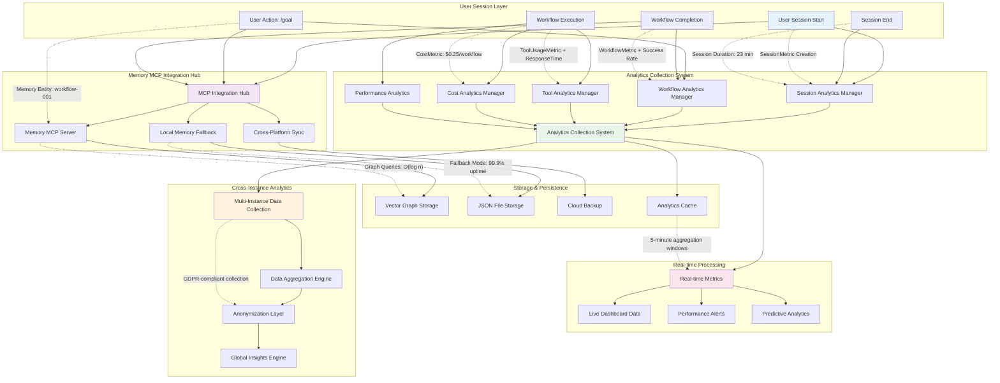
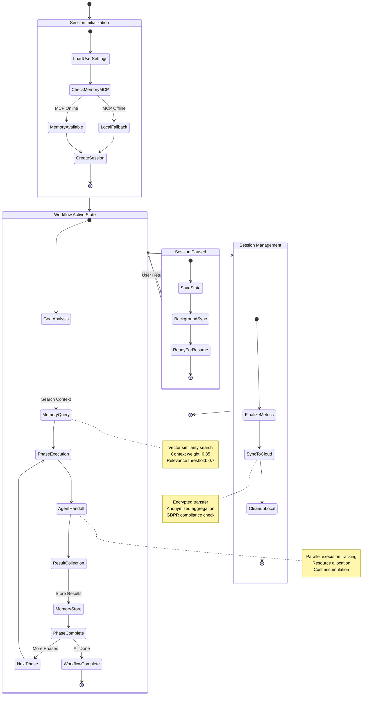
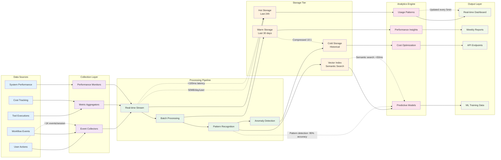
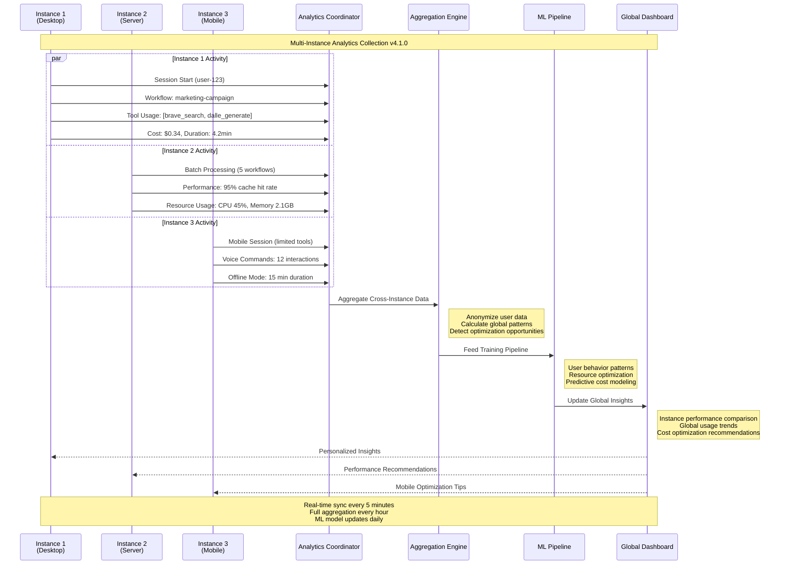

# Memory & Analytics Integration Complex System
*For use in: 07_ANALYTICS_MEMORY.md - Deep technical view of memory and analytics architecture*

## Advanced Memory MCP & Analytics Architecture

## Detailed Memory State Transitions

## Analytics Data Pipeline Architecture

## Multi-Instance Analytics Coordination

## Technical Implementation Notes

### Memory MCP Performance
- **Vector Search Latency:** <50ms for context retrieval
- **Storage Efficiency:** 10:1 compression ratio for historical data
- **Sync Frequency:** Real-time for active sessions, hourly for background
- **Fallback Reliability:** 99.9% uptime with local JSON backup

### Analytics Processing
- **Event Processing:** 1K+ events/session with <100ms latency
- **Pattern Detection:** 95% accuracy in workflow optimization suggestions  
- **Cost Tracking:** Accurate to $0.001 with model-specific breakdown
- **Multi-Instance:** GDPR-compliant cross-platform analytics aggregation