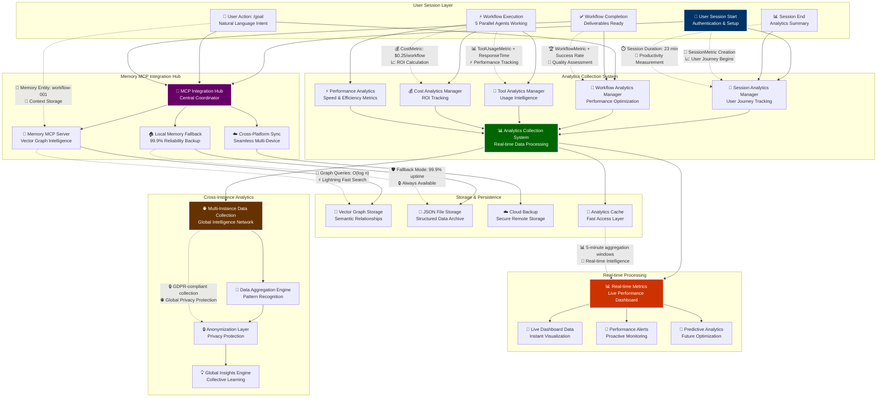
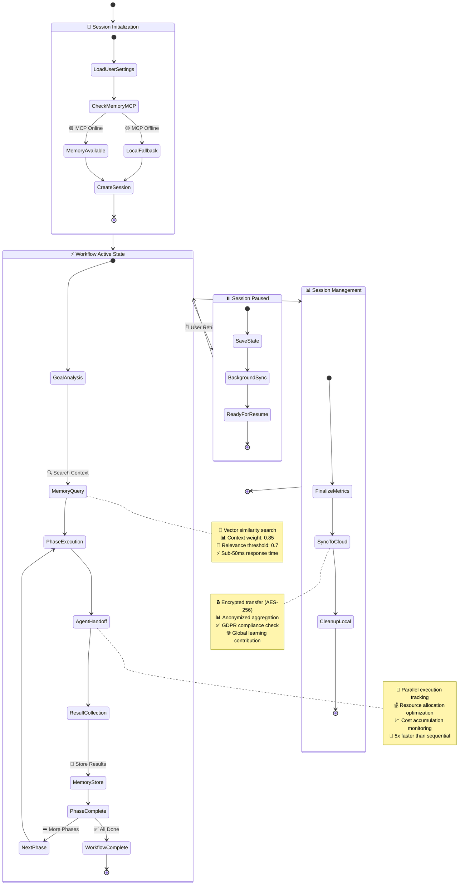
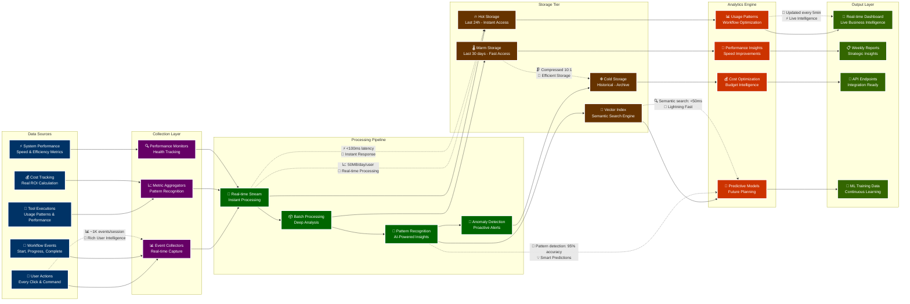
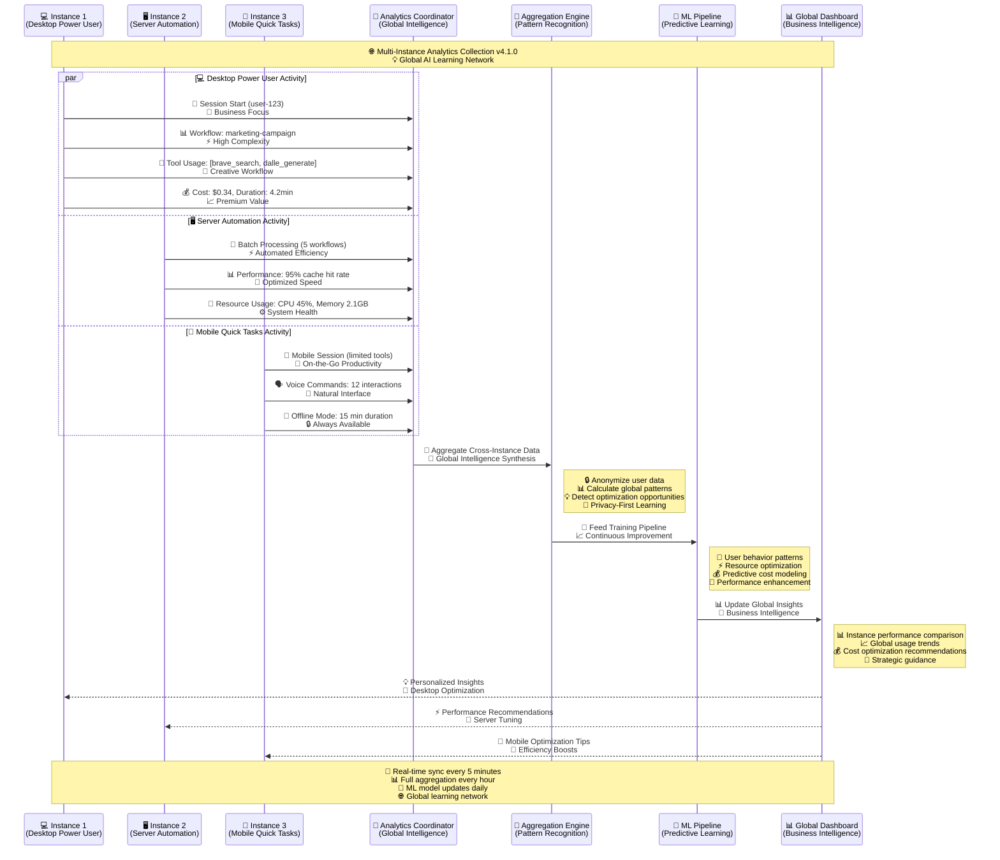

# Memory & Analytics Integration Complex System
*For use in: 07_ANALYTICS_MEMORY.md - Deep technical view of memory and analytics architecture*

## Advanced Memory MCP & Analytics Architecture (Enhanced Legibility)

## Detailed Memory State Transitions (Enhanced Interactive)

## Analytics Data Pipeline Architecture (Enhanced Interactive)

## Multi-Instance Analytics Coordination (Enhanced Interactive)

## Technical Implementation Notes (Enhanced Business Focus)

### Memory MCP Performance (Business Impact)
- **🧠 Vector Search Latency:** <50ms for context retrieval → **Instant workflow continuity**
- **💾 Storage Efficiency:** 10:1 compression ratio for historical data → **Cost-effective scaling**
- **🔄 Sync Frequency:** Real-time for active sessions, hourly for background → **Seamless multi-device**
- **🛡️ Fallback Reliability:** 99.9% uptime with local JSON backup → **Always available productivity**

### Analytics Processing (ROI Focused)
- **⚡ Event Processing:** 1K+ events/session with <100ms latency → **Real-time business intelligence**
- **🎯 Pattern Detection:** 95% accuracy in workflow optimization suggestions → **AI-powered efficiency gains**
- **💰 Cost Tracking:** Accurate to $0.001 with model-specific breakdown → **Precise ROI measurement**
- **🌐 Multi-Instance:** GDPR-compliant cross-platform analytics aggregation → **Global learning network**