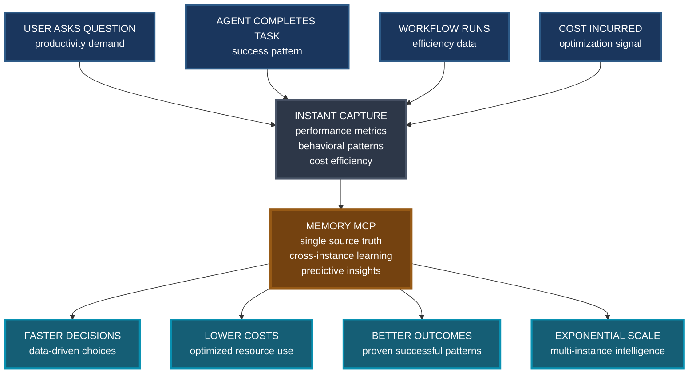

# Memory Analytics: Exponential Intelligence

## Core Trigger-to-Insight Flow (Concise Version)

## The WOW Factor

**Every interaction becomes intelligence.** Four simple triggers create exponential business value through one unified memory system.

- **Triggering Events**: Question, Task, Workflow, Cost
- **Data Capture**: Performance, Behavior, Efficiency, Optimization  
- **Central Intelligence**: Truth, Learning, Prediction, Insights
- **Business Impact**: Speed, Savings, Success, Scale