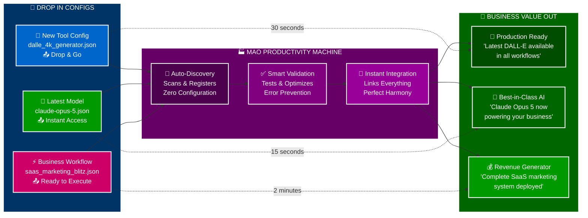
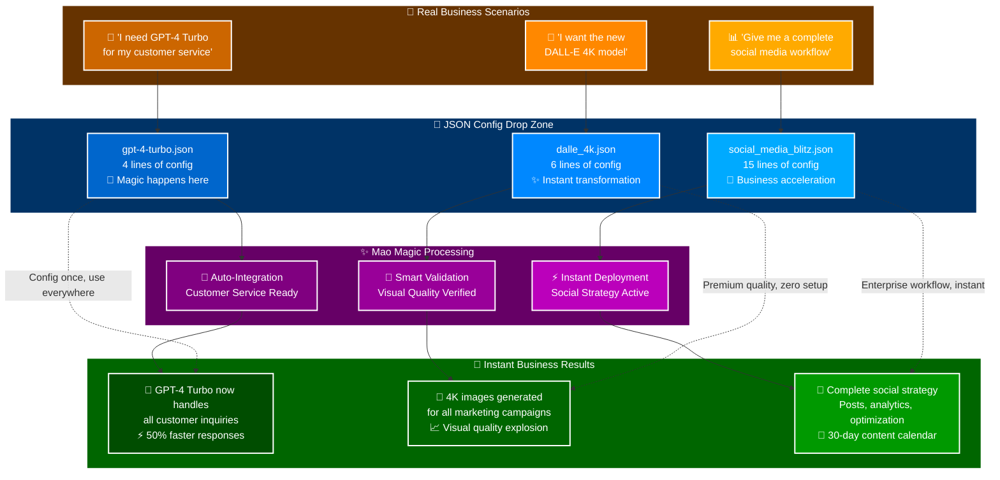

# System Architecture Overview
*For use in: 06_ORCHESTRATION.md - Showcasing Mao's plug-and-play modularity*

## The Config Drop Machine - Business Value Factory (Enhanced Legibility)



## The JSON Drop Magic - Real Examples (Enhanced Interactive)



## Claude Code: The Ultimate Config Generator (Enhanced Interactive)

```mermaid
flowchart LR
    subgraph USER_DREAM["💭 User's Vision"]
        DREAM["'I wish I had a tool that<br/>analyzes my competitors<br/>and suggests pricing'"]
        FOLLOW_UP["💬 'Can it also track<br/>market trends?'"]
    end
    
    subgraph CLAUDE_MAGIC["🪄 Claude Code Magic"]
        ANALYZE["🧠 Understand Request<br/>Parse business need"]
        CLARIFY["❓ Smart Questions<br/>'What markets and timeframe?'"]
        ARCHITECT["🏗️ Design Solution<br/>Plan enhanced tool architecture"]
        GENERATE["⚡ Generate Code<br/>Create complete enhanced tool"]
    end
    
    subgraph AUTO_CONFIGS["📁 Auto-Generated Configs"]
        MAIN_PY["competitor_pricing_pro.py<br/>✨ Full business logic + trends"]
        BUTTON_PY["button_competitor_pricing_pro.py<br/>🔘 Enhanced user interface"]
        UI_PY["ui_competitor_pricing_pro.py<br/>📊 Beautiful trend displays"]
        CONFIG_JSON["tool_competitor_pricing_pro.json<br/>⚙️ Perfect enhanced configuration"]
    end
    
    subgraph BUSINESS_READY["🎯 Business Ready"]
        DEPLOYED["🚀 Enhanced Tool Available<br/>Pricing + Trends analysis"]
        POWERFUL["💪 Enterprise-Grade Features<br/>Market insights, trend predictions"]
        SCALABLE["📈 Future-Proof Solution<br/>Adapts to new requirements"]
    end
    
    %% Interactive conversation flow
    DREAM --> ANALYZE
    ANALYZE --> CLARIFY
    CLARIFY --> FOLLOW_UP
    FOLLOW_UP --> ARCHITECT
    ARCHITECT --> GENERATE
    
    GENERATE --> MAIN_PY
    GENERATE --> BUTTON_PY
    GENERATE --> UI_PY
    GENERATE --> CONFIG_JSON
    
    MAIN_PY --> DEPLOYED
    BUTTON_PY --> DEPLOYED
    UI_PY --> DEPLOYED
    CONFIG_JSON --> DEPLOYED
    
    DEPLOYED --> POWERFUL
    POWERFUL --> SCALABLE
    
    %% Time annotations with interaction
    DREAM -.->|"Initial ask: 30 seconds"| CLARIFY
    FOLLOW_UP -.->|"Enhancement request"| ARCHITECT
    GENERATE -.->|"Code generation: 45 seconds"| CONFIG_JSON
    CONFIG_JSON -.->|"Deployment: Instant"| DEPLOYED
    
    %% Enhanced color scheme for better legibility
    style USER_DREAM fill:#663300,stroke:#ffffff,stroke-width:3px,color:#ffffff
    style CLAUDE_MAGIC fill:#660066,stroke:#ffffff,stroke-width:3px,color:#ffffff
    style AUTO_CONFIGS fill:#003366,stroke:#ffffff,stroke-width:3px,color:#ffffff
    style BUSINESS_READY fill:#006600,stroke:#ffffff,stroke-width:3px,color:#ffffff
    
    style DREAM fill:#cc6600,stroke:#ffffff,stroke-width:2px,color:#ffffff
    style FOLLOW_UP fill:#ff8800,stroke:#ffffff,stroke-width:2px,color:#ffffff
    
    style ANALYZE fill:#800080,stroke:#ffffff,stroke-width:2px,color:#ffffff
    style CLARIFY fill:#990099,stroke:#ffffff,stroke-width:2px,color:#ffffff
    style ARCHITECT fill:#bb00bb,stroke:#ffffff,stroke-width:2px,color:#ffffff
    style GENERATE fill:#dd00dd,stroke:#ffffff,stroke-width:2px,color:#ffffff
    
    style MAIN_PY fill:#0066cc,stroke:#ffffff,stroke-width:2px,color:#ffffff
    style BUTTON_PY fill:#0088ff,stroke:#ffffff,stroke-width:2px,color:#ffffff
    style UI_PY fill:#00aaff,stroke:#ffffff,stroke-width:2px,color:#ffffff
    style CONFIG_JSON fill:#00ccff,stroke:#ffffff,stroke-width:2px,color:#ffffff
    
    style DEPLOYED fill:#004d00,stroke:#ffffff,stroke-width:2px,color:#ffffff
    style POWERFUL fill:#006600,stroke:#ffffff,stroke-width:2px,color:#ffffff
    style SCALABLE fill:#009900,stroke:#ffffff,stroke-width:2px,color:#ffffff
```



## The Business Impact Factory (Enhanced Legibility)

```mermaid
sankey-beta
    "JSON Configs" --> "Mao Engine" : 100
    "Mao Engine" --> "Latest Models" : 30
    "Mao Engine" --> "Business Workflows" : 40  
    "Mao Engine" --> "Custom Tools" : 30
    "Latest Models" --> "Competitive Advantage" : 30
    "Business Workflows" --> "Revenue Growth" : 40
    "Custom Tools" --> "Operational Efficiency" : 30
```

## Usage Notes
- **All diagrams:** Enhanced legibility with high-contrast colors (dark backgrounds, white text)
- **Strategic interactions:** Shows back-and-forth conversations and clarifications
- **Color coding:** Different interaction types have distinct colors for easy following
- **Business focus:** Emphasizes immediate ROI and transformation value
- Perfect for demonstrating conversational AI and instant business impact