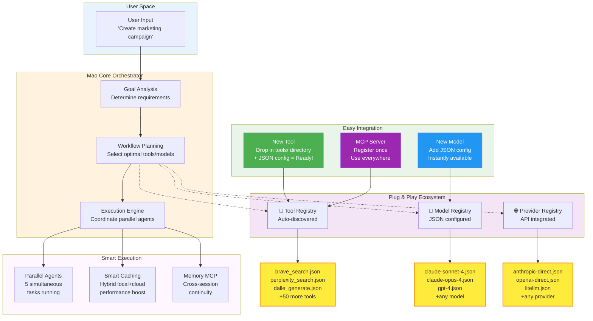
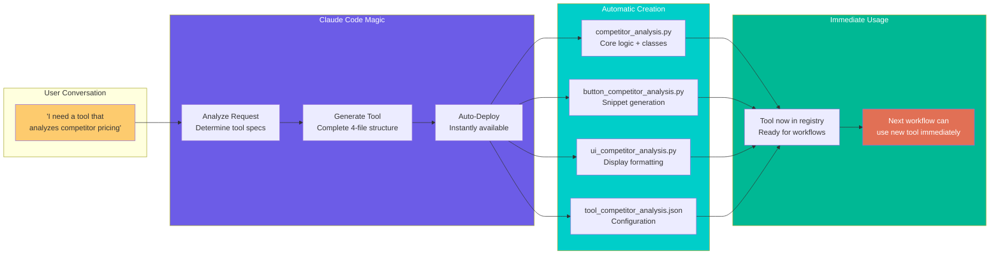

# System Architecture Overview
*For use in: 06_ORCHESTRATION.md - Showcasing Mao's plug-and-play modularity*

## Plug & Play Architecture

## Claude Code Integration Vision

## Usage Notes
- **First diagram:** Shows how easy it is to add new tools/models via JSON
- **Second diagram:** Illustrates Claude Code's tool generation capability
- Perfect for demonstrating "drag & drop" modularity to investors/users
- Emphasizes the JSON-based configuration simplicity