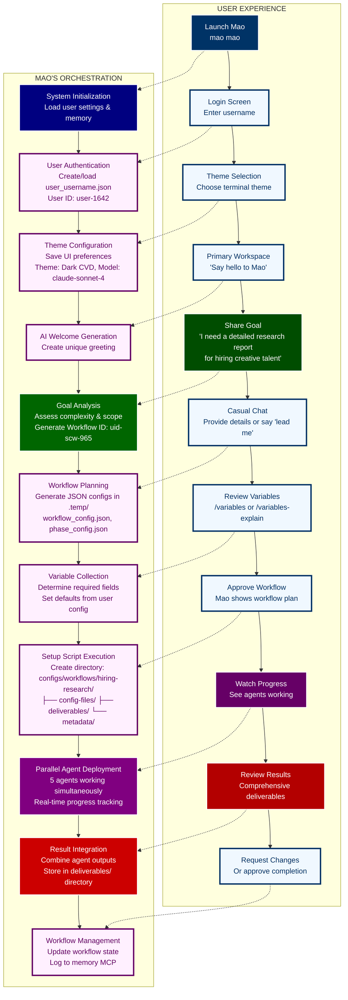
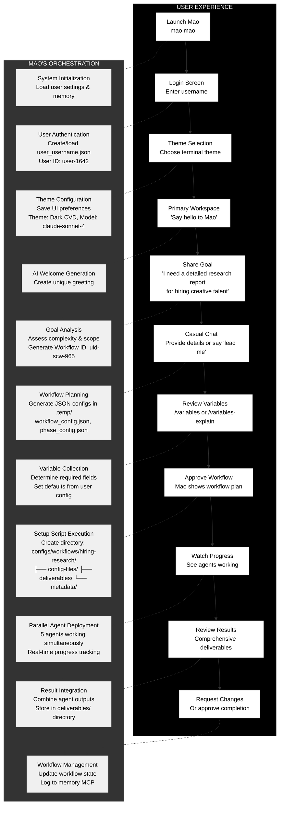

# User Journey Flow Diagram
*For use in: 03_USER_FLOW.md - Dual perspective showing user experience and Mao's orchestration*

## Enhanced Version (Better Legibility)

## Alternate High-Contrast Version

## Usage Notes
- **Enhanced Version:** Better for web display with improved contrast
- **High-Contrast Version:** Maximum legibility for presentations
- Both versions maintain the dual-perspective concept
- Colors can be further customized by modifying the style lines