# User Journey Flow Diagram
*For use in: 03_USER_FLOW.md - Dual perspective showing user experience and Mao's orchestration*

## Enhanced Interactive Version (Strategic Back-and-Forth)

```mermaid
flowchart TD
    subgraph USER["USER EXPERIENCE"]
        A1["Launch Mao<br/>mao mao"]
        A1 --> B1["Login Screen<br/>Enter username"]
        B1 --> C1["🎨 Theme Selection<br/>Choose terminal theme"]
        C1 --> D1["💬 Primary Workspace<br/>'Say hello to Mao'"]
        D1 --> E1["📝 Share Goal<br/>'I need a detailed research report<br/>for hiring creative talent'"]
        E1 --> F1["💭 Mao's Question<br/>'What's your target budget<br/>and timeline?'"]
        F1 --> G1["💬 User Response<br/>'$5K budget, need it by Friday'"]
        G1 --> H1["📋 Review Variables<br/>/variables or /variables-explain"]
        H1 --> I1["🤝 Approve Workflow<br/>'This looks perfect, let's go!'"]
        I1 --> J1["👀 Watch Progress<br/>See agents working in real-time"]
        J1 --> K1["📊 Review Results<br/>Comprehensive deliverables"]
        K1 --> L1["✨ Mao's Check-in<br/>'How did we do?'"]
        L1 --> M1["👍 User Feedback<br/>'Amazing! Can you also add<br/>salary benchmarking?'"]
        M1 --> N1["🚀 Enhanced Results<br/>Complete with bonus analysis"]
    end
    
    subgraph MAO["MAO'S ORCHESTRATION"]
        A2["System Initialization<br/>Load user settings & memory"]
        A2 --> B2["User Authentication<br/>Create/load user_username.json<br/>User ID: user-1642"]
        B2 --> C2["🎨 Theme Configuration<br/>Save UI preferences<br/>Theme: Dark CVD, Model: claude-sonnet-4"]
        C2 --> D2["🤖 AI Welcome Generation<br/>Create personalized greeting"]
        D2 --> E2["🧠 Goal Analysis<br/>Parse complexity & requirements<br/>Generate Workflow ID: uid-scw-965"]
        E2 --> F2["❓ Intelligent Questioning<br/>Identify missing parameters<br/>Budget: unknown, Timeline: unknown"]
        F2 --> G2["💾 Context Integration<br/>Budget: $5K, Timeline: 3 days<br/>Update workflow parameters"]
        G2 --> H2["⚙️ Variable Collection<br/>Auto-populate from conversation<br/>Set smart defaults"]
        H2 --> I2["📁 Setup Script Execution<br/>Create directory: configs/workflows/hiring-research/<br/>├── config-files/ ├── deliverables/ └── metadata/"]
        I2 --> J2["🔄 Parallel Agent Deployment<br/>5 agents working simultaneously<br/>Real-time progress tracking"]
        J2 --> K2["📊 Result Integration<br/>Combine agent outputs<br/>Store in deliverables/ directory"]
        K2 --> L2["✅ Quality Assessment<br/>Analyze completeness<br/>Identify enhancement opportunities"]
        L2 --> M2["🎯 Dynamic Enhancement<br/>Add salary benchmarking agent<br/>Integrate with existing workflow"]
        M2 --> N2["📋 Final Workflow Management<br/>Update state: enhanced-complete<br/>Log to memory MCP"]
    end
    
    %% Strategic exchanges - showing the conversation flow
    A1 -.-> A2
    B1 -.-> B2
    C1 -.-> C2
    D1 -.-> D2
    E1 -.-> E2
    F2 -.-> F1
    G1 -.-> G2
    H1 -.-> H2
    I1 -.-> I2
    J1 -.-> J2
    K1 -.-> K2
    L2 -.-> L1
    M1 -.-> M2
    N1 -.-> N2
    
    %% Enhanced color scheme for better contrast
    style A1 fill:#003366,stroke:#ffffff,stroke-width:2px,color:#ffffff
    style E1 fill:#004d00,stroke:#ffffff,stroke-width:2px,color:#ffffff
    style F1 fill:#800080,stroke:#ffffff,stroke-width:2px,color:#ffffff
    style G1 fill:#006600,stroke:#ffffff,stroke-width:2px,color:#ffffff
    style I1 fill:#660066,stroke:#ffffff,stroke-width:2px,color:#ffffff
    style J1 fill:#b30000,stroke:#ffffff,stroke-width:2px,color:#ffffff
    style L1 fill:#ff6600,stroke:#ffffff,stroke-width:2px,color:#ffffff
    style M1 fill:#0066cc,stroke:#ffffff,stroke-width:2px,color:#ffffff
    style N1 fill:#009900,stroke:#ffffff,stroke-width:2px,color:#ffffff
    
    style A2 fill:#000080,stroke:#ffffff,stroke-width:2px,color:#ffffff
    style E2 fill:#006600,stroke:#ffffff,stroke-width:2px,color:#ffffff
    style F2 fill:#990099,stroke:#ffffff,stroke-width:2px,color:#ffffff
    style G2 fill:#009900,stroke:#ffffff,stroke-width:2px,color:#ffffff
    style I2 fill:#800080,stroke:#ffffff,stroke-width:2px,color:#ffffff
    style J2 fill:#cc0000,stroke:#ffffff,stroke-width:2px,color:#ffffff
    style L2 fill:#ff8800,stroke:#ffffff,stroke-width:2px,color:#ffffff
    style M2 fill:#0088ff,stroke:#ffffff,stroke-width:2px,color:#ffffff
    style N2 fill:#00cc00,stroke:#ffffff,stroke-width:2px,color:#ffffff
    
    classDef userSide fill:#f0f8ff,stroke:#003366,stroke-width:3px,color:#003366
    classDef maoSide fill:#fff0ff,stroke:#660066,stroke-width:3px,color:#660066
    
    class A1,B1,C1,D1,E1,F1,G1,H1,I1,J1,K1,L1,M1,N1 userSide
    class A2,B2,C2,D2,E2,F2,G2,H2,I2,J2,K2,L2,M2,N2 maoSide
```

## Enhanced Version (Better Legibility)
*Same content as above but with the strategic back-and-forth exchanges*

## Alternate High-Contrast Version

```mermaid
flowchart TD
    subgraph USER["USER EXPERIENCE"]
        A1["Launch Mao<br/>mao mao"]
        A1 --> B1["Login Screen<br/>Enter username"]
        B1 --> C1["Theme Selection<br/>Choose terminal theme"]
        C1 --> D1["Primary Workspace<br/>'Say hello to Mao'"]
        D1 --> E1["Share Goal<br/>'I need a detailed research report<br/>for hiring creative talent'"]
        E1 --> F1["Mao's Question<br/>'What's your target budget<br/>and timeline?'"]
        F1 --> G1["User Response<br/>'$5K budget, need it by Friday'"]
        G1 --> H1["Review Variables<br/>/variables or /variables-explain"]
        H1 --> I1["Approve Workflow<br/>'This looks perfect, let's go!'"]
        I1 --> J1["Watch Progress<br/>See agents working in real-time"]
        J1 --> K1["Review Results<br/>Comprehensive deliverables"]
        K1 --> L1["Mao's Check-in<br/>'How did we do?'"]
        L1 --> M1["User Feedback<br/>'Amazing! Can you also add<br/>salary benchmarking?'"]
        M1 --> N1["Enhanced Results<br/>Complete with bonus analysis"]
    end
    
    subgraph MAO["MAO'S ORCHESTRATION"]
        A2["System Initialization<br/>Load user settings & memory"]
        A2 --> B2["User Authentication<br/>Create/load user_username.json<br/>User ID: user-1642"]
        B2 --> C2["Theme Configuration<br/>Save UI preferences<br/>Theme: Dark CVD, Model: claude-sonnet-4"]
        C2 --> D2["AI Welcome Generation<br/>Create personalized greeting"]
        D2 --> E2["Goal Analysis<br/>Parse complexity & requirements<br/>Generate Workflow ID: uid-scw-965"]
        E2 --> F2["Intelligent Questioning<br/>Identify missing parameters<br/>Budget: unknown, Timeline: unknown"]
        F2 --> G2["Context Integration<br/>Budget: $5K, Timeline: 3 days<br/>Update workflow parameters"]
        G2 --> H2["Variable Collection<br/>Auto-populate from conversation<br/>Set smart defaults"]
        H2 --> I2["Setup Script Execution<br/>Create directory: configs/workflows/hiring-research/<br/>├── config-files/ ├── deliverables/ └── metadata/"]
        I2 --> J2["Parallel Agent Deployment<br/>5 agents working simultaneously<br/>Real-time progress tracking"]
        J2 --> K2["Result Integration<br/>Combine agent outputs<br/>Store in deliverables/ directory"]
        K2 --> L2["Quality Assessment<br/>Analyze completeness<br/>Identify enhancement opportunities"]
        L2 --> M2["Dynamic Enhancement<br/>Add salary benchmarking agent<br/>Integrate with existing workflow"]
        M2 --> N2["Final Workflow Management<br/>Update state: enhanced-complete<br/>Log to memory MCP"]
    end
    
    A1 -.-> A2
    B1 -.-> B2
    C1 -.-> C2
    D1 -.-> D2
    E1 -.-> E2
    F2 -.-> F1
    G1 -.-> G2
    H1 -.-> H2
    I1 -.-> I2
    J1 -.-> J2
    K1 -.-> K2
    L2 -.-> L1
    M1 -.-> M2
    N1 -.-> N2
    
    %% High contrast version for maximum legibility
    style USER fill:#000000,stroke:#ffffff,stroke-width:4px,color:#ffffff
    style MAO fill:#333333,stroke:#ffffff,stroke-width:4px,color:#ffffff
    
    classDef userSide fill:#ffffff,stroke:#000000,stroke-width:2px,color:#000000
    classDef maoSide fill:#f0f0f0,stroke:#333333,stroke-width:2px,color:#000000
    
    class A1,B1,C1,D1,E1,F1,G1,H1,I1,J1,K1,L1,M1,N1 userSide
    class A2,B2,C2,D2,E2,F2,G2,H2,I2,J2,K2,L2,M2,N2 maoSide
```

## Usage Notes
- **Enhanced Interactive Version:** Shows strategic back-and-forth conversation flow
- **Key Exchanges:** Mao asks clarifying questions, user responds, Mao adapts
- **High-Contrast Version:** Maximum legibility for presentations
- **Color Coding:** Different colors highlight different types of interactions
- Shows the intelligent, conversational nature of Mao's workflow creation