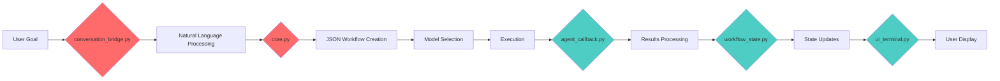

# Mao Data Flow Mapping & Cleanup Plan
*Context Window Conscious Approach to Understanding and Cleaning the Workflow System*

## 🎯 Mission
Map exactly how "User Goal → JSON Workflow → Execution" flows through Mao's files, eliminating hardcoded categorization poison along the way.

## 📋 Current Understanding (From Dev Index)

### Known Data Flow Patterns:
```
Goal → Analysis → Phase Design → Model Selection → Execution → Results → Caching
```

### Key Files Identified:
1. **`conversation_bridge.py`** - "Convert natural language to workflow configs"
2. **`core.py`** - "Main logic for creating workflow from goals" + execution
3. **`workflow_state.py`** - "Track workflow execution states" 
4. **`agent_callback.py`** - "Process execution results"
5. **`ui_terminal.py`** - "Display execution progress"

## 🗺️ Working Flow Diagram



**🔴 Red = Needs Investigation (Likely Hardcoded)**  
**🔵 Blue = Probably Clean**

## 📝 Session-by-Session Mapping Plan

### Session Template:
```markdown
## Session [N]: [File Name]

**Start With:** Current diagram state
**Focus:** [Specific file]
**Goals:** 
- Map file's role in data flow
- Identify hardcoded categorizations
- Plan cleanup approach
- Update diagram

**Context Handoff:** Updated diagram + specific cleanup notes
```

### Planned Sessions:

#### Session 1: conversation_bridge.py
- **Question:** How does natural language become structured data?
- **Look For:** Hardcoded domain categories, workflow patterns
- **Update:** Bridge role in diagram

#### Session 2: core.py (Workflow Creation)
- **Question:** How are JSON workflow configs actually created?
- **Look For:** Hardcoded phase patterns, agent roles, task instructions
- **Update:** Core creation logic in diagram

#### Session 3: Model/Tool Managers
- **Question:** How do configs get loaded and selected?
- **Look For:** Whether managers are clean or also have hardcoding
- **Update:** Selection logic in diagram

#### Session 4: Execution Flow
- **Question:** How do workflows actually run?
- **Look For:** Execution assumptions, result processing
- **Update:** Execution path in diagram

#### Session 5: State & Callback
- **Question:** How are results tracked and processed?
- **Look For:** State management assumptions
- **Update:** Complete flow diagram

## 🧼 Cleanup Tracking

### Hardcoding Patterns to Watch For:
- [ ] "Domain-specific suggestions (not hardcoded)" → followed by hardcoded lists
- [ ] English workflow assumptions (research → analysis → creative)
- [ ] Hardcoded model names ("claude-sonnet-4")
- [ ] Predefined complexity categories
- [ ] Business domain assumptions
- [ ] Agent role templates

### Files Status:
- [ ] `conversation_bridge.py` - **Not Mapped**
- [ ] `core.py` - **Partially Analyzed** (Major hardcoding found)
- [ ] `workflow_state.py` - **Not Mapped**
- [ ] `agent_callback.py` - **Partially Clean** (Some hardcoding removed)
- [ ] `manager_models.py` - **Not Mapped**
- [ ] `manager_tools.py` - **Not Mapped**
- [ ] `ui_terminal.py` - **Not Mapped**

## 🎯 Cursor Handoff Package

### What Cursor Will Get:
1. **Complete Visual Flow Diagram** - Every file's role mapped
2. **File-by-File Cleanup Checklist** - Specific patterns to eliminate
3. **Replacement Logic** - How each file should work without hardcoding
4. **Test Cases** - Multilingual goals to verify cleanup worked

### Success Criteria:
- [ ] User can input goals in any language
- [ ] No hardcoded English workflow assumptions
- [ ] All model/tool selection from configs
- [ ] Clean, simple logic flow
- [ ] Maintained functionality

## 📊 Context Window Strategy

### Each Session Starts With:
1. **Current diagram state** (from Memory MCP)
2. **Focus file** for this session
3. **Specific questions** to answer
4. **Previous findings** summary

### Each Session Ends With:
1. **Updated diagram** with new file mapped
2. **Hardcoding findings** for the focus file
3. **Memory MCP update** with progress
4. **Next session plan**

## 🔄 Session Handoff Template

```markdown
**Memory MCP Update:**
- File: [filename]
- Role: [what it does in the flow]
- Hardcoding Found: [specific patterns]
- Cleanup Needed: [specific changes]
- Diagram Status: [updated sections]

**Next Session Focus:** [next file to map]
```

## 🚀 Ready to Start

**First Session Goal:** Map `conversation_bridge.py` role and identify hardcoded language processing assumptions.

**Starting Questions:**
1. How does it convert natural language to structured data?
2. What hardcoded categories or patterns exist?
3. How should it work with true modularity?

**Context Window Prep:**
- Load current Memory MCP state
- Read conversation_bridge.py 
- Focus only on data flow mapping
- Document findings for Cursor handoff